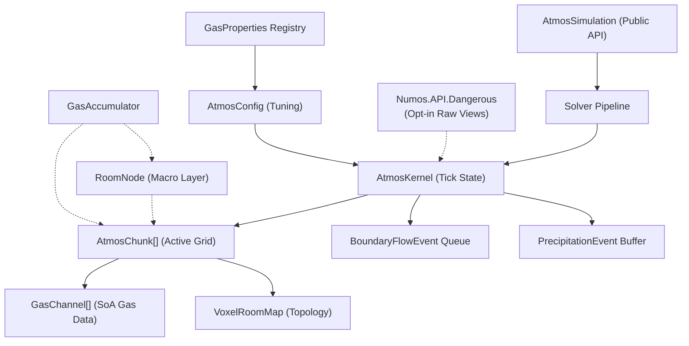

# Atmospherics System — Technical Documentation

> [!NOTE]
> Pressure, thermodynamics, phase changes, and energy transfer use the explicit SI unit model described below. Other legacy sections may not reflect every current implementation detail.

> **Revision**: 2026-08-19
> **Scope**: Engine-agnostic specification.
---

## Table of Contents

1. [Design Goals](#1-design-goals)
2. [Architecture Overview](#2-architecture-overview)
   - 2.1 [Public and Dangerous API Boundaries](#21-public-and-dangerous-api-boundaries)
3. [Data Model](#3-data-model)
   - 3.1 [Voxel Grid & Chunk](#31-voxel-grid--chunk)
   - 3.2 [Gas Channels (Structure of Arrays)](#32-gas-channels-structure-of-arrays)
   - 3.3 [Voxel Classification](#33-voxel-classification)
   - 3.4 [Room Nodes (Macro Layer)](#34-room-nodes-macro-layer)
   - 3.5 [Gas Properties Registry](#35-gas-properties-registry)
   - 3.6 [Configuration Parameters](#36-configuration-parameters)
   - 3.7 [Container and Voxel Gas Mixtures](#37-container-and-voxel-gas-mixtures)
4. [Simulation Loop](#4-simulation-loop)
   - 4.1 [Fixed Timestep Accumulator](#41-fixed-timestep-accumulator)
   - 4.2 [Solver Pipeline](#42-solver-pipeline)
   - 4.3 [Stage 1 — Pressure Advection](#43-stage-1--pressure-advection)
   - 4.4 [Stage 2 — Cross-Chunk Boundary Flow](#44-stage-2--cross-chunk-boundary-flow)
   - 4.5 [Stages 3 and 4 — Thermodynamics and Thermal Boundaries](#45-stages-3-and-4--thermodynamics-and-thermal-boundaries)
5. [Stability & Convergence Mechanisms](#5-stability--convergence-mechanisms)
   - 5.1 [Per-Neighbor Bulk-Flow Cap](#51-per-neighbor-bulk-flow-cap)
   - 5.2 [Damping & Low-Delta Regime](#52-damping--low-delta-regime)
   - 5.3 [Minimum Pressure Transfer (Stiction)](#53-minimum-pressure-transfer-stiction)
   - 5.4 [Vacuum Cleanup](#54-vacuum-cleanup)
   - 5.5 [Delta Buffers (Ordering Scope)](#55-delta-buffers-ordering-scope)
6. [Sleep System](#6-sleep-system)
7. [The Leaky Faucet Problem & GasAccumulator](#7-the-leaky-faucet-problem--gasaccumulator)
8. [Phase Changes (Condensation)](#8-phase-changes-condensation)
   - 8.1 [Clausius-Clapeyron Saturation Model](#81-clausius-clapeyron-saturation-model)
   - 8.2 [Phase-Change Internal-Energy Balance](#82-phase-change-internal-energy-balance)
9. [Networking & Replication](#9-networking--replication)
10. [Known Flaws & Limitations](#10-known-flaws--limitations)
11. [Porting Guidance](#11-porting-guidance)

---

## 1. Design Goals

The system is built to simulate atmospheric gas dynamics in the context of a space-station or sealed-environment game. The core design priorities, as observable from the code, are:

1. **Performance with auditable units.** The simulation uses the ideal-gas law `P = nRT/V` with one configurable, uniform voxel volume. Pressure is stored in pascals, temperature in kelvins, amount in moles, and sensible energy in joules. The cellular flow model remains a game-oriented approximation rather than a Navier–Stokes solver.
2. **Work-proportional cost.** CPU cycles should be spent only on regions with active pressure gradients. Stable rooms should cost effectively zero.
3. **Engine independence.** The core simulation logic has no dependency on any specific game engine, rendering framework, or platform API. It is written as a standalone module that can be dropped into any engine's update loop.
4. **Multi-gas support.** The system tracks multiple independent gas species with distinct physical properties. Memory is allocated lazily per-gas, per-chunk.

---

## 2. Architecture Overview

The system uses a two-layer Level of Detail (LOD) model:

| Layer | Name | Granularity | Cost | When Active |
|-------|------|-------------|------|-------------|
| **Macro** | Room Node | Whole-room aggregate | O(1) per room | Room is at equilibrium (sleeping) |
| **Micro** | Atmos Chunk | Per-voxel cellular automata | O(n) per active voxel | Room has turbulent pressure gradients |

When a disturbance exceeds a configurable threshold (the "Threshold of Violence"), the macro-layer room transitions to the micro-layer voxel grid. When the voxel grid reaches equilibrium, it goes back to sleep and the macro layer resumes responsibility.

### Component Relationships



### 2.1 Public and Dangerous API Boundaries

Numos deliberately exposes two package-level integration surfaces:

| Package | Intended use | Compatibility                        | State access                                      |
|---------|--------------|--------------------------------------|---------------------------------------------------|
| `Numos.API` | Normal engine and game integration | Supported public contract            | Handles, validated operations, detached snapshots |
| `Numos.API.Dangerous` | Measured performance-critical solver code | No compatibility guarantee (for now) | Callback-scoped live spans and unchecked state views |

The dangerous package must be referenced separately and imported through `Numos.API.Dangerous`. Access begins with
`simulation.Dangerous()`. Standard custom solvers use detached snapshots and validated mutations. Dangerous custom
solvers are stack-scoped callbacks over live chunk arrays and gas-channel spans; they are responsible for maintaining
cache, topology, and revision invariants after raw writes.

The kernel hooks used by this package live in `AtmosKernel.Dangerous.cs`, keeping them distinct from the internal
operations that back the supported facade. `AtmosKernel`, `AtmosChunk`, and gas-channel representations remain
internal CLR types and are never returned directly from either package.

---

## 3. Data Model

### 3.1 Voxel Grid & Chunk

A chunk is a 3D grid of voxels, parameterized by `Width`, `Height`, and `Depth` (a common default is 16×16×16, or 4,096 voxels).

All per-voxel data is stored in flat 1D arrays indexed by:

```
index = x + (y * Width) + (z * Width * Height)
```

The inverse mapping is:

```
x = index % Width
y = (index / Width) % Height
z = index / (Width * Height)
```

Each chunk stores:

| Array | Type | Description |
|-------|------|-------------|
| `VoxelRoomMap` | `int[]` | Classifies each voxel (see §3.3) |
| `TotalPressure` | `float[]` | Cached pressure per voxel in pascals (Pa), recalculated at advection start and refreshed as state changes |
| `Temperature` | `float[]` | Temperature in kelvins (K) per voxel |
| `TotalHeatCapacity` | `float[]` | Cached total heat capacity per voxel, in J/K |
| `ActiveAirIndices` | `ushort[]` | Dense list of voxel indices belonging to the currently active rooms |
| `ActiveGases` | `GasChannel[]` | Sparse array of gas-specific mole data (see §3.2) |

For thermodynamic calculations, each gas uses an effective molar heat capacity at constant volume:

```
c_fallback = isFinite(DefaultMolarHeatCapacityAtConstantVolume) && DefaultMolarHeatCapacityAtConstantVolume > 0
    ? DefaultMolarHeatCapacityAtConstantVolume
    : 5R/2
c_effective = gasIsRegistered && isFinite(MolarHeatCapacityAtConstantVolume) && MolarHeatCapacityAtConstantVolume > 0
    ? MolarHeatCapacityAtConstantVolume
    : c_fallback
C_voxel = sum(moles[g] * c_effective[g])
E_voxel = C_voxel * effectiveTemperature
P_voxel = totalMoles * R * effectiveTemperature / VoxelVolume
```

`C_voxel` is a total heat capacity in J/K, not a molar heat capacity. `E_voxel` is the sensible internal energy represented by the voxel state, so the model uses constant-volume heat capacity (`C_v`) rather than constant-pressure heat capacity (`C_p`). `R` is the molar gas constant (`8.31446262 J/(mol·K)`) and `VoxelVolume` is in m³, making `P_voxel` pascals. `DefaultMolarHeatCapacityAtConstantVolume` defaults to the ideal-diatomic value `5R/2` (`20.786... J/(mol·K)`) and is normalized to that value if configured to a non-finite or nonpositive value. The heat-capacity cache is recalculated or updated whenever gas composition changes. When a gas-bearing voxel's stored temperature is non-finite or nonpositive, pressure and energy calculations use `DefaultTemperatureFallback`; an invalid fallback is normalized to `293.15 K`. An energy update then stores its calculated blended, diffused, or phase-change temperature.

The gas-constant value and SI relationship follow the [NIST reference constants](https://physics.nist.gov/cgi-bin/cuu/Value?r).

Chunks are identified by an `Int3 GridPosition` in a spatial map (e.g. a `ConcurrentDictionary<Int3, AtmosChunk>`).

**Active Air Optimization**: Steady-state physics loops iterate the dense `ActiveAirIndices` list rather than every voxel. `WakeRoom(roomId)` adds the room to `ActiveRoomIds` up to the configured `MaxActiveRooms`, then `RebuildActiveAirIndices` scans all `VoxelCount` entries and rebuilds the list with voxels from every active room. The rebuild is therefore O(`VoxelCount`) (4,096 entries for a default 16×16×16 chunk), while subsequent physics work is proportional to the active list.

### 3.2 Gas Channels (Structure of Arrays)

Each gas species present in a chunk is represented by a `GasChannel`:

```
struct GasChannel {
    int GasId;
    float[] Moles;  // Length = VoxelCount, rented from ArrayPool
}
```

Key properties:

- **Lazy allocation**: A `GasChannel` is only created when that gas type is first introduced to a chunk via `InjectGasToVoxel`. A chunk containing only oxygen will have one channel; a chunk containing oxygen, nitrogen, and plasma will have three.
- **ArrayPool rental**: The `Moles` array is rented from `System.Buffers.ArrayPool<float>` and cleared to zero on allocation. This avoids GC pressure from repeated allocations. The array must be explicitly returned via `Release()`.
- **Growable channel table**: `ActiveGases` begins with `AtmosChunkConstants.InitialGasChannelCapacity` slots (currently 16) and doubles only when another distinct gas ID reaches the chunk. Existing per-gas mole arrays remain untouched, preserving the structure-of-arrays solver layout while permitting arbitrary gas IDs and counts.

> [!NOTE]
> The `ArrayPool` may return an array larger than requested. Only the first `VoxelCount` entries are used. Implementations should clear only the requested range.

### 3.3 Voxel Classification

Each voxel in `VoxelRoomMap` is assigned an integer value that determines its behavior:

| Value | Constant | Behavior |
|-------|----------|----------|
| `0` | `RoomUnassigned` | Open, pressurizable volume not yet assigned to a room. Gas can exist here. |
| `> 0` | *(Room ID)* | Belongs to a specific named room. Participates in simulation when that room is awake. |
| `-1` | `RoomVoid` | Infinite sink / true vacuum. Gas entering this voxel is destroyed. Used for map boundaries or active vents. Pressure is always treated as 0. |
| `-2` | `RoomSolid` | Solid obstruction (wall/floor). Blocks gas flow completely. |

### 3.4 Room Nodes (Macro Layer)

When a room is at equilibrium (sleeping), it is represented by a `RoomNode`:

```
struct RoomNode {
    int RoomId;
    bool IsAsleep;
    int VoxelCount;
    float VoxelVolume;
    float EquilibriumPressure;
    float AverageTemperature;
    float TotalHeatCapacity;
    float TotalMoles;
    float[] GasMoles;  // Total moles of each gas in the entire room
}
```

The `RoomNode` provides O(1) gas addition/removal using the ideal gas law:

- **AddGas**: Recalculates `AverageTemperature` by conserving sensible internal energy with the incoming species' `C_v`, then updates `EquilibriumPressure = TotalMoles * R * AverageTemperature / (VoxelCount * VoxelVolume)`.
- **RemoveGas**: Clamps removal to available moles, removes the species' heat capacity, and recalculates pressure. Temperature is not changed on removal (assumes a uniform mixture).

> [!IMPORTANT]
> The `RoomNode` is defined with complete logic but is **not wired into the simulation loop**. `AtmosSimulation` operates exclusively at the voxel (micro) level. The `RoomNode` and `GasAccumulator` exist as data structures with complete logic, but the orchestration that transitions between macro and micro layers is not implemented. An integrator must build this transition logic.

### 3.5 Gas Properties Registry

Each gas species is defined by a `GasProperties` struct:

| Field | Type | Purpose |
|-------|------|---------|
| `Name` | `string` | Display name |
| `MolarHeatCapacityAtConstantVolume` | `float` | Molar `C_v` in J/(mol·K). It controls sensible internal energy during injection, gas flow, thermal diffusion, and condensation. Energy and capacity paths use `DefaultMolarHeatCapacityAtConstantVolume` for missing registry entries and non-finite or nonpositive values; condensation skips unregistered gas IDs. |
| `BoilingPoint` | `float` | Normal boiling temperature (K) at `SaturationReferencePressure` |
| `CondensationEnabled` | `bool` | Enables this species in the condensation model. |
| `MolarEnthalpyOfVaporization` | `float` | Vaporization enthalpy in J/mol, used by Clausius–Clapeyron and converted to an approximate constant-volume internal-energy change for condensation. |
| `LiquidId` | `int` | ID of the liquid this gas condenses into (for a separate liquid simulation system) |
| `DiffusionCoefficient` | `float` | Dimensionless fraction of the per-species mole imbalance mixed per simulation tick; finite values are clamped to [0, 1], and non-finite values disable species diffusion. |

The registry is stored as a `List<GasProperties>` indexed by gas ID; zero is a valid gas ID.

### 3.6 Configuration Parameters

All tunable simulation parameters are centralized in a configuration object:

The literals backing these defaults are exposed through `AtmosConfigDefaults`, while immutable SI and reference
condition values are exposed through `AtmosPhysicalConstants`. Internal fixed-step scheduling values and numerical
cutoffs live in `AtmosSolverConstants`; they are deliberately not presented as runtime configuration. Default chunk
dimensions and initial chunk capacities are exposed through `AtmosChunkConstants`, while reserved room IDs have a
single definition in `VoxelClassification`.

| Parameter | Default | Description |
|-----------|---------|-------------|
| `GlobalTemperature` | 293.15 | Reference ambient temperature (K). Not actively used in the simulation loop. |
| `DefaultTemperatureFallback` | 293.15 | Starting effective temperature (K) used for pressure and sensible energy when a gas-bearing voxel stores a non-finite or nonpositive temperature. Invalid values normalize to 293.15 K. |
| `DefaultMolarHeatCapacityAtConstantVolume` | `5R/2` | Ideal-diatomic molar `C_v` in J/(mol·K), used for missing registry entries and non-finite or nonpositive gas heat capacities. A non-finite or nonpositive fallback value is normalized to the same value. |
| `VoxelVolume` | 1 | Physical volume represented by each voxel (m³). Invalid values normalize to 1 m³. |
| `SaturationReferencePressure` | 101325 | Pressure (Pa) at which each gas's `BoilingPoint` applies. Invalid values normalize to one standard atmosphere. |
| `DefaultDiffusionCoefficient` | 0.02 | Dimensionless per-tick mixing fraction for unregistered gas IDs. Finite values are clamped to [0, 1]; non-finite values disable fallback diffusion. |
| `SpaceTemperature` | 2.7 | Temperature of space (K). Not actively used in the simulation loop. |
| `BulkFlowCoefficient` | 0.25 | Dimensionless fraction of pressure delta requested as bulk flow per tick. Finite values are clamped to [0, 1]; non-finite values disable the large-delta branch. |
| `BulkFlowDamping` | 0.5 | Multiplier applied to `BulkFlowCoefficient` during large-delta advection to reduce oscillation. Finite values are clamped to [0, 1]; non-finite values disable the large-delta branch. |
| `LowPressureDeltaThreshold` | 5.0 | Below this pressure delta (Pa), flow uses `MaxPressureTransferFractionPerNeighbor` directly instead of `BulkFlowCoefficient * BulkFlowDamping`. Invalid or negative values normalize to zero. |
| `MinimumPressureTransfer` | 0.1 | Candidate pressure transfers below this magnitude (Pa/tick) are discarded ("stiction"). Invalid or negative values normalize to zero. |
| `VacuumThreshold` | 1.0 | Below this pressure (Pa), voxel contents are zeroed out. Invalid or negative values normalize to zero. |
| `SleepThreshold` | 100 | Consecutive ticks below `SleepEpsilon` before a chunk goes to sleep. Negative values normalize to zero. |
| `SleepEpsilon` | 3.5 | Maximum pressure delta considered "at rest" (Pa). Invalid or negative values normalize to zero. |
| `ThermalConductance` | 0.05 | Effective per-face conductance in J/K per thermodynamics tick. Multiplying it by a temperature difference produces a candidate energy transfer, which is bounded for explicit-solver stability. Invalid or nonpositive values disable thermal diffusion. |
| `CondensationRateFactor` | 0.5 | Dimensionless fraction of supersaturated vapor condensed per thermodynamics tick. Finite values are clamped to [0, 1]; non-finite values disable condensation. |
| `MaxPressureTransferFractionPerNeighbor` | 0.16 | Maximum fraction of a voxel's pressure requested as bulk flow to one neighbor per tick. Finite values are clamped to [0, 1]; non-finite values disable bulk flow. |

### 3.7 Container and Voxel Gas Mixtures

`IGasMixture` provides one public interaction model for portable containers and individual voxels while preserving
the solver's structure-of-arrays layout:

- `AtmosSimulation.CreateGasMixture(volume, temperature)` returns a concrete `GasMixture` with independent sparse
  storage. Its `Volume` can be changed, and it is suitable for canisters, tanks, pipes, pumps, or temporary parcels.
- `AtmosSimulation.GetVoxelGasMixture(...)` returns an `IGasMixture` capability over one live voxel. It does not
  contain or expose spans, gas-channel arrays, or references into pooled solver memory.
- Every mixture retains its owning `AtmosSimulation`. Transfers require both endpoints to have the same owner, so
  gas IDs and molar heat capacities are interpreted through one live configuration.
- `IGasMixture` is a common capability surface rather than an extension point. Transfer endpoints must be mixtures
  created by `AtmosSimulation`; external implementations are rejected before either endpoint changes.
- A voxel capability records the chunk generation at creation. Removing and recreating a chunk at the same position
  makes the old capability stale instead of silently retargeting it to unrelated state.
- Voxel reads and mutations enter the simulation state lock. Multi-endpoint transfers capture and validate both
  results before committing, preventing simulation ticks from observing a half-applied transfer.
- Solid and void voxels can be inspected but reject mutation. Disposing the owner invalidates both container and
  voxel mixtures.

The common surface exposes volume, temperature, pressure, total moles, sparse gas lookup, snapshots, proportional
removal, and transfer operations. `SetMoles` and `AdjustMoles` intentionally preserve the stored temperature for
low-level tooling parity. `AddGas` and transfers instead conserve sensible internal energy using each gas's effective
constant-volume molar heat capacity. Pressure is always derived from `P = nRT/V` rather than being independently
mutable.

The `Temperature` setter stores its raw value for parity with direct voxel tooling. Non-finite and nonpositive stored
temperatures are interpreted through `DefaultTemperatureFallback` when pressure or sensible energy is calculated.
Creation and incoming-gas operations still require finite, nonnegative temperatures.

At the start of each simulation tick, the solver captures one normalized configuration and gas-property snapshot.
This keeps the tick internally consistent while retaining the public live-configuration model, and avoids repeating
configuration validation in the per-neighbor and per-species loops.

Persistent voxel state, per-voxel thermal work buffers, and production atmos calculations use single precision
end-to-end. Overflow-prone formulas use algebraically equivalent float forms: thermal equilibrium conductance is
evaluated without forming `C1 * C2`, temperature updates use `T + ΔE/C`, and heat-capacity-weighted mixing uses
bounded interpolation. Finite-range checks reject results that cannot be represented by the float-backed state.
Double precision is reserved for test/reference reductions, avoiding production float-to-double conversions while
preserving an independent, higher-precision conservation check.

```csharp
var canister = simulation.CreateGasMixture(volume: 0.07f, temperature: 293.15f);
canister.AddGas(oxygenId, moles: 2f, temperature: 293.15f);

IGasMixture voxel = simulation.GetVoxelGasMixture(chunk, x: 4, y: 3, z: 0);
float moved = canister.TransferTo(voxel, moles: 0.5f);
GasMixture sample = voxel.RemoveRatio(0.1f);
```

The API follows the useful container semantics of
[SS14's `GasMixture`](https://github.com/space-wizards/space-station-14/blob/master/Content.Shared/Atmos/GasMixture.cs)
while replacing its globally sized per-mixture gas array with sparse container storage and locked SoA voxel access.

---

## 4. Simulation Loop

### 4.1 Fixed Timestep Accumulator

The simulation runs on a fixed timestep, decoupled from the rendering frame rate:

```
SimulationRate = 20.0 Hz
FixedDt = 1 / SimulationRate = 0.05 seconds
MaxStepsPerFrame = 5
```

Each frame:
1. `elapsedSeconds` is added to an accumulator.
2. The accumulator is clamped to `FixedDt * MaxStepsPerFrame` to prevent a "spiral of death" when frame rate drops.
3. While the accumulator ≥ `FixedDt`, a simulation tick is consumed.

### 4.2 Solver Pipeline

Each tick captures one chunk/configuration snapshot, increments the tick counter, and executes the ordered
`simulation.Solvers` pipeline. Its default stages are:

1. `advection`
2. `boundary-flow`
3. `thermodynamics`
4. `thermal-boundary`

Stages can be enabled, disabled, removed, or restored with `ResetToDefaults`. Standard delegates can be appended or
inserted before/after any named stage:

```csharp
simulation.Solvers.RegisterAfter(AtmosBuiltInSolvers.Advection, "game-reactions", context =>
{
    foreach (AtmosChunkHandle chunk in context.Chunks)
    {
        AtmosChunkSnapshot snapshot = context.GetChunkSnapshot(chunk);
        // Inspect the detached snapshot and apply results through validated context methods.
    }
});

simulation.Solvers.SetEnabled(AtmosBuiltInSolvers.Thermodynamics, false);
```

Pipeline edits made by a callback take effect on the next tick. Transient boundary-event queues are cleared at the
start of every tick, so disabling a consumer stage cannot replay stale events when it is later re-enabled.

Solvers that have a measured need to avoid snapshot copies can opt into live storage through the separate dangerous
package:

```csharp
simulation.Dangerous().Solvers.RegisterAfter(AtmosBuiltInSolvers.Advection, "fast-reaction", context =>
{
    AtmosDangerousChunk chunk = context.GetChunk(0);
    Span<float> oxygen = chunk.GetGasChannel(0).Moles;
    // Raw writes are unchecked. Repair affected caches/topology and call MarkChanged as required.
});
```

Gas injection is an atomic solver operation shared by the supported API, boundary flow, and dangerous solver context.
It recalculates the target voxel's existing total SHC from its gas composition before temperature mixing. Dangerous
pipeline injection uses the normalized gas properties and pressure coefficient captured for that tick.

The four default stages are described below.

### 4.3 Stage 1 — Pressure Advection

This is the core fluid dynamics step. It runs in parallel across chunks.

**For each awake chunk:**

1. **Recalculate pressure and heat capacity**: For every active voxel, `TotalPressure[i] = TotalMoles[i] * R * effectiveTemperature[i] / VoxelVolume`. `effectiveTemperature` is the stored temperature when it is finite and positive, otherwise the normalized `DefaultTemperatureFallback`. The kernel also caches `TotalHeatCapacity[i] = sum(moles[g] * c_effective[g])` for energy calculations.

2. **Compute flow deltas**: For every active voxel, examine each Von Neumann neighbor (±X, ±Y, ±Z — 4 neighbors for 2D chunks, 6 for 3D):
   - Skip solid neighbors.
   - Treat void neighbors as pressure 0.
   - Calculate `pressureDelta = currentPressure - neighborPressure`.
   - If `pressureDelta > 0` (flow is outward):
     - If `pressureDelta < LowPressureDeltaThreshold`: use `flow = pressureDelta * MaxPressureTransferFractionPerNeighbor`.
     - Else: use `flow = pressureDelta * BulkFlowCoefficient * BulkFlowDamping`.
     - Discard if `flow < MinimumPressureTransfer`.
     - Clamp: `flow = min(flow, currentPressure * MaxPressureTransferFractionPerNeighbor)`.
     - Convert the pressure transfer to moles: `advectedMoles = flow * VoxelVolume / (R * sourceEffectiveTemperature)`, then multiply by each species' mole fraction.
     - Compute the sensible energy carried by each species: `energyToMove = molesToMove * c_effective * sourceEffectiveTemperature`.
     - Cap each species' combined scheduled outflow across all neighbors to the moles present at the start of the pass.
     - Accumulate mole and energy changes into flat delta buffers (not applied immediately). Gas entering a void contributes no target delta, so both its moles and energy leave the simulation.

3. **Fickian Diffusion**: Independently of the total-pressure gradient and bulk-flow cutoff, a species diffusion term based on partial-pressure imbalance is applied:
   ```
   deltaN = moles[src] - moles[neighbor] * (neighborTemp / srcTemp)
   molesDiffused = deltaN * DiffusionCoefficient
   ```
   This allows gases with different diffusion rates to mix after bulk pressure has equalized and permits one species to counter-diffuse against the net bulk-flow direction. Coefficients are clamped to [0, 1] for explicit-step stability. The Z-axis is checked conditionally, only when `Depth > 1`, allowing efficient 2D operation.

4. **Apply deltas**: After all voxels have been processed, the accumulated mole deltas are applied and per-species amounts below `AtmosSolverConstants.MinimumTrackedMoles` (currently 0.0001 mol) are snapped to 0. Each voxel's heat capacity is recalculated from its new composition, then its temperature is recovered from `newTemperature = (oldTotalHeatCapacity * oldEffectiveTemperature + energyDelta) / newTotalHeatCapacity`. A voxel with no heat capacity retains its stored temperature. The pressure cache is refreshed from the resulting moles and temperature before boundary processing.

5. **Emit boundary events**: If a voxel is on the edge of the chunk (coordinate is 0 or `Size - 1`) and has positive pressure at or above the normalized `VacuumThreshold`, a `BoundaryFlowEvent` is emitted for cross-chunk processing.

### 4.4 Stage 2 — Cross-Chunk Boundary Flow

Boundary events are collected into a `ConcurrentQueue` during the parallel advection phase, then processed **sequentially** afterward.

For each boundary event:
1. Determine the source voxel's coordinates.
2. For each of the 6 directions, check if the neighbor coordinate is outside the chunk bounds.
3. If outside: look up the neighboring chunk at `GridPosition + direction`.
4. Map the out-of-bounds coordinate into the neighbor's local space using modular arithmetic: `nX = (targetX + neighborWidth) % neighborWidth`.
5. If the neighbor voxel is solid, skip.
6. Calculate any outward bulk pressure transfer with the same limiter used by intra-chunk advection, including damping, the low-delta branch, minimum-transfer cutoff, and the per-neighbor cap. A sleeping target is woken only if a positive mole transfer will actually be injected.
7. For each source species, combine bulk advection with the same positive partial-pressure diffusion term used inside a chunk. Diffusion is evaluated even when bulk flow is zero or points in the opposite direction:
   ```
   molesAdvected = (flow * VoxelVolume / (R * sourceEffectiveTemperature)) * moleFraction
   deltaN = sourceMoles - neighborMoles * (neighborEffectiveTemperature / sourceEffectiveTemperature)
   molesDiffused = DiffusionCoefficient > 0 ? max(0, deltaN * DiffusionCoefficient) : 0
   molesMoved = min(sourceMoles, molesAdvected + molesDiffused)
   ```
   For a void target, neighbor moles and temperature are treated as zero. An unregistered gas uses `DefaultDiffusionCoefficient`.
8. Transfer the capped moles directly (no delta buffer — this is sequential).

Each species carries `molesMoved * c_effective * sourceEffectiveTemperature` of sensible energy during the direct transfer. The source and target heat-capacity caches, temperatures, and pressures are updated immediately by energy balance. Before injection, the target voxel's existing heat capacity is recalculated from its current moles and the normalized gas registry captured for the tick, including for a target chunk that was sleeping before the transfer.

If the adjacent chunk is not registered or the mapped target is solid, no transfer occurs. A non-void target room is woken before it receives gas. A void target is an energy sink: transferred moles and their carried energy are removed from the source without being added to a target voxel.

### 4.5 Stages 3 and 4 — Thermodynamics and Thermal Boundaries

Thermodynamics runs at half frequency (every 2nd tick) to save computation. Execution order is:

1. In parallel for each awake chunk, solve intra-chunk thermal diffusion and queue thermal-boundary events.
2. Still within that per-chunk pass, process phase changes using the post-diffusion voxel state.
3. After all parallel chunk work completes, deduplicate cross-chunk faces and solve them from one immutable boundary snapshot. Boundary handling recalculates current pressure, heat capacity, and effective temperature, so it uses post-phase-change state.

**Intra-Chunk Thermal Diffusion**: Adjacent non-vacuum voxels exchange energy according to their temperature difference and total heat capacities. Intra-chunk diffusion uses a two-pass solve from one immutable temperature and heat-capacity snapshot. Each undirected edge `(i, j)` is visited once, and its pair conductance is:

```
g_ij = min(ThermalConductance, C_i * C_j / (C_i + C_j))
G_i = sum(g_ij for every edge incident to i)
s_ij = min(1, C_i / G_i, C_j / G_j)
Q_ij = s_ij * g_ij * (T_i - T_j)
```

The first pass accumulates each voxel's incident conductance `G`; the second recomputes the same edges and buffers equal-and-opposite energy deltas. The symmetric scale ensures the total applied conductance at either endpoint cannot exceed that endpoint's heat capacity, so each result is a convex combination of the snapshot temperatures. This removes traversal-direction bias, conserves energy, and prevents new temperature extrema. Voxels with zero heat capacity do not participate and retain their stored temperature.

**Phase Changes (Condensation)**: See §8. These run after intra-chunk thermal temperatures have been applied and before thermal-boundary events are drained.

**Cross-Chunk Thermal Diffusion**: Boundary faces are deduplicated, their post-phase-change temperatures and heat capacities are snapshotted, and the same `g`, `G`, `s`, and `Q` equations are applied across the entire boundary set. Equal-and-opposite energy deltas are buffered before any boundary temperature is written, eliminating concurrent-queue traversal bias. Solid voxels block conduction, voxels below `VacuumThreshold` are excluded, and a missing adjacent chunk receives no heat. Depth-one chunks do not conduct through their Z faces. Thermal transfer can update a sleeping neighbor without waking it.

---

## 5. Stability & Convergence Mechanisms

The advection loop is a first-order explicit cellular automaton, which is inherently prone to oscillation ("ringing") if flow per tick exceeds stability limits. The system employs several interlocking mechanisms to ensure convergence.

### 5.1 Per-Neighbor Bulk-Flow Cap

The per-neighbor cap limits the bulk pressure-transfer candidate from a source voxel to one neighbor:

```
bulkFlowPerNeighbor ≤ currentPressure * MaxPressureTransferFractionPerNeighbor
```

With the default `MaxPressureTransferFractionPerNeighbor = 0.16 ≈ 1/6`, the six bulk-flow candidates in a 3D neighborhood total at most about 96% of the source pressure. This is a local inventory/stability heuristic, not a formal CFL number because the model does not track wave speed or cell length. The bound applies only to bulk advection: the Fickian term is added afterward and can make the combined requested species outflow exceed that amount.

A separate gas-major `scheduledOutflows` buffer provides the actual inventory protection. For each gas and source voxel, every neighbor transfer is capped to `sourceMoles - alreadyScheduledOutflow`, so aggregate scheduled outflow cannot exceed the moles present at the start of the pass. Neighbors are checked in fixed `-X`, `+X`, `-Y`, `+Y`, then (for 3D) `-Z`, `+Z` order. If requests exhaust the inventory, later directions receive only the remainder, so the safety cap can introduce directional allocation bias under saturation.

Design note: a naive bulk cap of 0.5 is unstable for more than 2 neighbors (0.5 * 6 = 3.0 > 1.0); 0.16 (≈1/6) keeps the six 3D bulk candidates below one source-pressure inventory, while `scheduledOutflows` enforces the final mole bound after diffusion is included.

### 5.2 Damping & Low-Delta Regime

Two regimes are used depending on the magnitude of the pressure delta:

- **Large delta** (`pressureDelta ≥ LowPressureDeltaThreshold`): `flow = pressureDelta * BulkFlowCoefficient * BulkFlowDamping`. The `BulkFlowDamping` (0.5) reduces the effective flow rate to kill ringing in high-energy scenarios.
- **Small delta** (`pressureDelta < LowPressureDeltaThreshold`): `flow = pressureDelta * MaxPressureTransferFractionPerNeighbor`. This bypasses the friction model and uses the configured low-delta fraction directly.

### 5.3 Minimum Pressure Transfer (Stiction)

Flows below `MinimumPressureTransfer` (0.1) are discarded entirely. This prevents infinitesimal flows from keeping a chunk awake indefinitely and accelerates convergence by eliminating micro-oscillations.

### 5.4 Vacuum Cleanup

Voxels with `TotalPressure < VacuumThreshold` (1.0) have all gas moles zeroed out. This prevents the accumulation of trace gas amounts that would otherwise never fully equalize and would keep chunks awake.

### 5.5 Delta Buffers (Ordering Scope)

Mole and sensible-energy transfers within a chunk are not applied directly during the neighbor scan. They are accumulated into a rented `float[]` whose first `VoxelCount` entries are the per-voxel energy-delta lane and whose remaining gas-major lanes hold mole deltas at `(gasIndex + 1) * VoxelCount + voxelIndex`. After every active source voxel has been scanned, the mole and energy deltas are applied together in a single pass.

This buffering prevents an earlier voxel's applied result from changing the snapshot read by a later voxel, so results do not depend on active-voxel iteration order when the neighbor order is held fixed. It does not make every permutation equivalent: the separate `scheduledOutflows` safety cap is consumed in fixed neighbor order, as described in §5.1, and can favor earlier directions when a source saturates.

Both the delta array and the gas-major `scheduledOutflows` array are rented from `ArrayPool<float>` and returned after application.

> [!NOTE]
> Cross-chunk gas and thermal transfers do **not** use these buffers. They update current state immediately during sequential boundary processing, which introduces event-order dependence when multiple boundary events affect the same voxel.

---

## 6. Sleep System

Each chunk maintains a `SleepTimer` counter. After each advection pass:

1. The maximum pressure delta across all neighbor pairs in the chunk (`maxPressureDelta`) is tracked.
2. If `maxPressureDelta < SleepEpsilon` (3.5): increment `SleepTimer`.
3. If `SleepTimer > SleepThreshold` (100): set `IsAwake = false`. The chunk ceases all processing.
4. If `maxPressureDelta ≥ SleepEpsilon`: reset `SleepTimer` to 0.

A sleeping chunk is woken when:
- `InjectGasToVoxel` is called on it (the sleep timer is reset).
- A boundary flow event targets one of its voxels (the target room is woken via `WakeRoom`).

The sleep system is the primary mechanism for achieving the "work-proportional cost" goal. In a station with 500 chunks, only the handful with active pressure gradients consume CPU.

Unit tests confirm convergence to sleep for L-shaped, donut-shaped, and zigzag room geometries, with pressure equilibrating to within 1.0 moles of the average across all voxels.

---

## 7. The Leaky Faucet Problem & GasAccumulator

### The Problem

A slow, continuous gas leak (e.g., a cracked pipe) produces a flow rate below the "Threshold of Violence" that would wake the voxel grid. Without mitigation, there are two bad outcomes:
1. **Wake the grid every tick**: The voxel simulation runs continuously for a negligible leak, wasting CPU.
2. **Ignore it**: The leak is never simulated, producing incorrect atmospheric state.

### The Solution: GasAccumulator

The `GasAccumulator` acts as a buffer between a gas source and the simulation:

```
struct GasAccumulator {
    int GasId;
    float AccumulatedMoles;
    float OutputTemperature;  // Mole-weighted running average
    int TicksAlive;
    const int MaxAliveTimeBeforeReset = 20;
}
```

Each tick, the leaking source calls `AddGas(moles, temperature)`, which accumulates mass and tracks a weighted-average temperature.

The caller then evaluates the accumulator state:

```
EvaluateState(currentPressureDelta, wakeThreshold) → Hold | Diffuse | Inject
```

| State | Condition | Action |
|-------|-----------|--------|
| **Hold** | Delta < threshold AND ticks < max | Continue accumulating. Do nothing. |
| **Diffuse** | Delta < threshold AND ticks ≥ max (20) | Release accumulated gas into the `RoomNode` (macro layer). The leak is too slow to matter at the voxel level. |
| **Inject** | Delta ≥ threshold | Wake the chunk and inject accumulated gas into the voxel grid (micro layer). The leak has built up enough pressure to warrant full simulation. |

After either `Diffuse` or `Inject`, the accumulator is reset.

Unit tests confirm:
- A 0.5 Pa delta holds.
- A 5.0 Pa delta after 20 ticks diffuses to the macro layer.
- A 150.0 Pa spike injects immediately.

> [!IMPORTANT]
> As with the `RoomNode`, the `GasAccumulator` is **fully implemented as a data structure** but is **not wired into the simulation loop**. `AtmosSimulation` does not reference it. An integrator must build the orchestration that feeds gas sources into accumulators and dispatches the resulting `Diffuse` or `Inject` actions. The unit tests for `GasAccumulator` test the struct in isolation.

---

## 8. Phase Changes (Condensation)

### 8.1 Clausius-Clapeyron Saturation Model

Condensation is modeled using a saturation-vapor-pressure approach based on the Clausius-Clapeyron equation:

```
T_effective = storedTemperature > 0 && isFinite(storedTemperature)
    ? storedTemperature
    : DefaultTemperatureFallback
```

`SaturationReferencePressure` defaults to one standard atmosphere (`101325 Pa`) and is the pressure at which the configured `BoilingPoint` applies.

For a registered species, phase-change processing first requires `CondensationEnabled`, more than `0.01` moles in the voxel, and a positive effective temperature. Condensation then occurs when partial pressure exceeds saturation:

```
if gasIsRegistered && CondensationEnabled && gasMoles > 0.01 && T_effective > 0:
    P_sat = SaturationReferencePressure
            * exp(-(MolarEnthalpyOfVaporization / R) * (1/T_effective - 1/T_boiling))
    currentPartialPressure = gasMoles * R * T_effective / VoxelVolume
    if currentPartialPressure > P_sat:
        excessPressure = currentPartialPressure - P_sat
        requestedMoles = (excessPressure * VoxelVolume / (R * T_effective))
                         * CondensationRateFactor
        molesToCondense = min(gasMoles, requestedMoles)
```

Dividing molar vaporization enthalpy by `R` makes the exponential dimensionless. This integrated Clausius–Clapeyron form assumes ideal vapor and approximately constant vaporization enthalpy over the modeled temperature interval. Subject to the gates above, this model allows condensation at any temperature where the gas is supersaturated rather than only below a fixed temperature. Gas IDs without a registry entry, invalid boiling points, and invalid or nonpositive vaporization enthalpies are skipped.

The approximation and its assumptions match the integrated ideal-vapor derivation summarized in [NISTIR 5321](https://nvlpubs.nist.gov/nistpubs/Legacy/IR/nistir5321.pdf).

### 8.2 Phase-Change Internal-Energy Balance

Condensation removes both the condensed gas's heat capacity and the sensible energy that gas carried. Clausius–Clapeyron uses vaporization enthalpy, but this is a constant-volume internal-energy balance, so the released energy per mole is approximated as `ΔU_vap = max(0, ΔH_vap - RT)`. Let `n_condensed` be the number of moles condensed, `c_effective` the species' effective molar `C_v`, and `C_before` the voxel's total heat capacity before condensation:

```
C_after = max(0, C_before - n_condensed * c_effective)
E_after = T_effective * C_before
          - T_effective * n_condensed * c_effective
          + n_condensed * max(0, MolarEnthalpyOfVaporization - R * T_effective)
if C_after > 0:
    T_after = max(0, E_after / C_after)
```

The temperature division is performed only when `C_after > 0`. The voxel's cached `TotalHeatCapacity` and `TotalPressure` are updated immediately. As elsewhere in the energy model, a non-finite or nonpositive configured `MolarHeatCapacityAtConstantVolume` uses the normalized `DefaultMolarHeatCapacityAtConstantVolume`.

Phase-change energy generally warms the remaining gas, which raises saturation pressure and slows further condensation. Accounting for both the ideal-gas `pV` term and the condensed gas's departing sensible energy avoids assigning enthalpy directly to a constant-volume internal-energy state.

### Output: PrecipitationEvent

Condensed gas is packaged into a `PrecipitationEvent`:

```
struct PrecipitationEvent {
    ushort LocalVoxelIndex;
    int LiquidId;
    float CondensedMoles;
    float Temperature;
}
```

These events are written to a thread-local buffer and are intended to be consumed by a separate liquid simulation system. That liquid system is not part of this codebase. Each worker's buffer holds `VoxelCount` events for the configured chunk dimensions. Phase changes can emit one event per gas per voxel, so multiple condensable species can exceed this capacity; the simulation then throws `InvalidOperationException` rather than dropping the event.

---

## 9. Networking & Replication

The reference implementation includes stubs and data structures for network synchronization, but the networking logic itself is not implemented.

### Snapshot Replication

`AtmosChunkSnapshot` is a full-fidelity copy of a chunk's state:

```
struct AtmosChunkSnapshot {
    Int3 GridPosition;
    float[] TotalPressure;   // 4096 floats
    float[] Temperature;     // 4096 floats
    GasSnapshot[] Gases;     // Per-gas mole arrays
    int[] VoxelRoomMap;      // 4096 ints
}
```

A helper class `AtmosNetworkCompression` provides 8-bit quantization for pressure values (0–1000 range mapped to 0–255), but comments note this is unused and full float data is currently synced.

### Network Events

`GasInjectionEvent` is defined for replicating sudden gas injections (explosions, tank ruptures):

```
struct GasInjectionEvent {
    Vector3 Position;
    int GasId;
    float Moles;
    float Temperature;
}
```

The `AtmosNetworkManager` contains method stubs for:
- Sending injection events to the server.
- Server-side RPC handling (world position → chunk/voxel mapping, then `InjectGasToVoxel`).
- Client-side visual/audio response.

All networking methods are stubs with comments indicating where real implementation would go.

---

## 10. Known Flaws & Limitations

### Structural

1. **Macro-micro transition not implemented.** The `RoomNode`, `GasAccumulator`, and the transition logic between macro (sleeping room) and micro (active voxel grid) layers are defined as data structures but are not orchestrated by the simulation loop. An integrator must implement: (a) how a sleeping room's aggregate state seeds the voxel grid on wake, (b) how a sleeping voxel grid's state is collapsed back into a `RoomNode`, and (c) how `GasAccumulator` feeds into this process.

### Numerical

2. **Unidirectional flow in advection.** The advection loop only processes flow from high pressure to low (`pressureDelta > 0`). Due to the delta buffer, each voxel-pair transfer is computed from the higher-pressure side and applied after the neighbor scan.

### Capacity

3. **Precipitation-event buffer is sized per voxel, not per gas-voxel pair.** Each worker has room for `VoxelCount` precipitation events, but phase changes can emit an event for every condensable gas in every voxel. If more than `VoxelCount` events are generated during one thermodynamics pass, the simulation throws `InvalidOperationException`.

### Performance

4. **Per-tick chunk snapshot via `.ToArray()`.** Each tick, the simulation calls `_chunkMap.Values.ToArray()` to snapshot the chunk collection. This allocates a new array every tick. For large chunk counts at 20 Hz, this generates significant GC pressure.

---

## 11. Porting Guidance

To implement this system in another engine or language, start from the core module described in this document:
- `AtmosSimulation` — the supported public facade.
- `AtmosKernel` — the internal tick driver and physics implementation.
- `AtmosChunk` — the parameterized voxel grid.
- `AtmosConfig` — all tunable parameters.
- `GasChannel`, `GasProperties`, `RoomNode` — all data structures.
- `Types.cs` — standalone `Int3`, `Vector3`, event structs.

### What to build

| Component | Status | Action Required |
|-----------|--------|-----------------|
| Tick driver integration | ✅ Complete | Call `AtmosSimulation.Update(deltaSeconds)` from your engine's update loop. |
| Chunk lifecycle | ✅ Complete | Call `CreateAndRegisterChunk` / `UnregisterChunk`; chunks remain owned by the simulation. |
| Voxel topology | ✅ API provided | Populate topology through `SetChunkClassification` and `SetVoxelClassification`. |
| Room detection | ❌ Not provided | You must implement flood-fill or connected-component analysis to assign room IDs to contiguous open volumes in `VoxelRoomMap`. |
| Macro-micro transition | ❌ Not provided | You must implement the logic that seeds voxel grids from `RoomNode` state on wake, and collapses back on sleep. |
| GasAccumulator orchestration | ❌ Not provided | You must implement the per-source accumulator loop and dispatch `Diffuse`/`Inject` actions. |
| Gas source API | ✅ API provided | Use `AddGasToVoxel` for game-side sources such as pipes, vents, and fires. |
| Liquid system | ❌ Not provided | `PrecipitationEvent` is produced but never consumed. Build a liquid simulation if needed. |
| Visualization | ❌ Not provided | Pressure, temperature, and gas composition are available per-voxel. You must build rendering (overlays, particle effects, fog). |
| Networking | ❌ Snapshot only | `AtmosChunkSnapshot` is exposed, but serialization, transport, and client reconciliation are not implemented. |

### Parallelism

The simulation assumes parallel execution:
- **Intra-chunk advection and thermodynamics** are dispatched in parallel across chunks (e.g. via a `Parallel.ForEach`-style construct).
- **Gas and thermal boundary processing** is sequential and must remain so to avoid race conditions when two chunks write to each other's voxels.
- **Thread-local buffers** (`ThreadLocal<T>`) are used for gas-boundary, thermal-boundary, and precipitation events to avoid contention.

If your target platform does not support threading (e.g., single-threaded WASM), the simulation will still function correctly when run sequentially — the parallel regions have no ordering dependencies within them.

### Memory

At 16×16×16 with one gas:
- Per chunk: about **88 KB** for `VoxelRoomMap`, `TotalPressure`, `Temperature`, `TotalHeatCapacity`, `ActiveAirIndices`, and one `GasChannel`, excluding smaller metadata arrays and pool overhead.
- Per additional gas: +16 KB.
- 512 chunks (8×8×8 grid): about **44 MB** before pool overhead and metadata.

`ArrayPool` rental means actual memory footprint depends on pool behavior. Arrays may be larger than requested and may persist in the pool after `Release()`.
