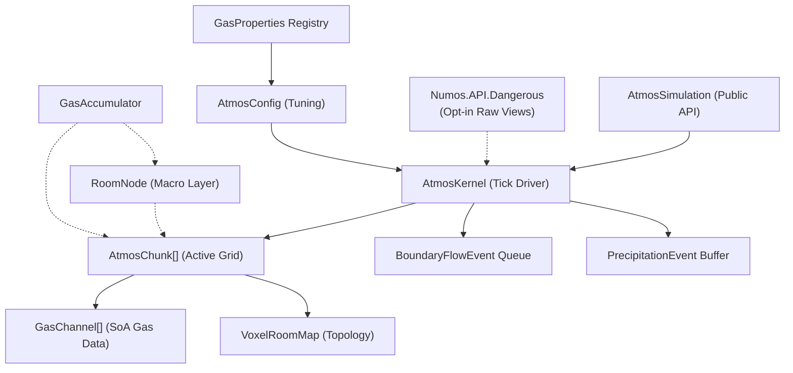

# Atmospherics System — Technical Documentation

> [!NOTE]
> The thermodynamics and energy-transfer sections were updated for the effective molar heat-capacity model. Other legacy sections may not reflect every current implementation detail.

> **Revision**: 2026-08-15
> **Scope**: Engine-agnostic specification.
---

## Table of Contents

1. [Design Goals](#1-design-goals)
2. [Architecture Overview](#2-architecture-overview)
   - 2.1 [Public and Dangerous API Boundaries](#21-public-and-dangerous-api-boundaries)
3. [Data Model](#3-data-model)
   - 3.1 [Voxel Grid & Chunk](#31-voxel-grid--chunk)
   - 3.2 [Gas Channels (Structure of Arrays)](#32-gas-channels-structure-of-arrays)
   - 3.3 [Voxel Classification](#33-voxel-classification)
   - 3.4 [Room Nodes (Macro Layer)](#34-room-nodes-macro-layer)
   - 3.5 [Gas Properties Registry](#35-gas-properties-registry)
   - 3.6 [Configuration Parameters](#36-configuration-parameters)
4. [Simulation Loop](#4-simulation-loop)
   - 4.1 [Fixed Timestep Accumulator](#41-fixed-timestep-accumulator)
   - 4.2 [Phase 1 — Pressure Advection](#42-phase-1--pressure-advection)
   - 4.3 [Phase 2 — Cross-Chunk Boundary Flow](#43-phase-2--cross-chunk-boundary-flow)
   - 4.4 [Phase 3 — Thermodynamics](#44-phase-3--thermodynamics)
5. [Stability & Convergence Mechanisms](#5-stability--convergence-mechanisms)
   - 5.1 [CFL Flow Cap](#51-cfl-flow-cap)
   - 5.2 [Damping & Snap-to-Equilibrium](#52-damping--snap-to-equilibrium)
   - 5.3 [Minimum Flow Cutoff (Stiction)](#53-minimum-flow-cutoff-stiction)
   - 5.4 [Vacuum Cleanup](#54-vacuum-cleanup)
   - 5.5 [Delta Buffers (Ordering Scope)](#55-delta-buffers-ordering-scope)
6. [Sleep System](#6-sleep-system)
7. [The Leaky Faucet Problem & GasAccumulator](#7-the-leaky-faucet-problem--gasaccumulator)
8. [Phase Changes (Condensation)](#8-phase-changes-condensation)
   - 8.1 [Clausius-Clapeyron Saturation Model](#81-clausius-clapeyron-saturation-model)
   - 8.2 [Latent-Heat Energy Balance](#82-latent-heat-energy-balance)
9. [Networking & Replication](#9-networking--replication)
10. [Known Flaws & Limitations](#10-known-flaws--limitations)
11. [Porting Guidance](#11-porting-guidance)

---

## 1. Design Goals

The system is built to simulate atmospheric gas dynamics in the context of a space-station or sealed-environment game. The core design priorities, as observable from the code, are:

1. **Performance over physical fidelity.** The simulation uses a simplified ideal gas law (`P = n * T`) with unit voxel volume rather than the full `PV = nRT` with real gas constants. This trades physical accuracy for speed and tunability.
2. **Work-proportional cost.** CPU cycles should be spent only on regions with active pressure gradients. Stable rooms should cost effectively zero.
3. **Engine independence.** The core simulation logic has no dependency on any specific game engine, rendering framework, or platform API. It is written as a standalone module that can be dropped into any engine's update loop.
4. **Multi-gas support.** The system tracks multiple independent gas species with distinct physical properties. Memory is allocated lazily per-gas, per-chunk.

---

## 2. Architecture Overview

The system uses a two-layer Level of Detail (LOD) model:

| Layer | Name | Granularity | Cost | When Active |
|-------|------|-------------|------|-------------|
| **Macro** | Room Node | Whole-room aggregate | O(1) per room | Room is at equilibrium (sleeping) |
| **Micro** | Atmos Chunk | Per-voxel cellular automata | O(n) per active voxel | Room has turbulent pressure gradients |

When a disturbance exceeds a configurable threshold (the "Threshold of Violence"), the macro-layer room transitions to the micro-layer voxel grid. When the voxel grid reaches equilibrium, it goes back to sleep and the macro layer resumes responsibility.

### Component Relationships



### 2.1 Public and Dangerous API Boundaries

Numos deliberately exposes two package-level integration surfaces:

| Package | Intended use | Compatibility                        | State access                                      |
|---------|--------------|--------------------------------------|---------------------------------------------------|
| `Numos.API` | Normal engine and game integration | Supported public contract            | Handles, validated operations, detached snapshots |
| `Numos.API.Dangerous` | Measured performance-critical code | No compatibility guarantee (for now) | No impl for now.                                  |

The dangerous package must be referenced separately and imported through `Numos.API.Dangerous`. Access begins with
`simulation.Dangerous()`.

The kernel hooks used by this package live in `AtmosKernel.Dangerous.cs`, keeping them distinct from the internal
operations that back the supported facade. `AtmosKernel`, `AtmosChunk`, and gas-channel representations remain
internal CLR types and are never returned directly from either package.

---

## 3. Data Model

### 3.1 Voxel Grid & Chunk

A chunk is a 3D grid of voxels, parameterized by `Width`, `Height`, and `Depth` (a common default is 16×16×16, or 4,096 voxels).

All per-voxel data is stored in flat 1D arrays indexed by:

```
index = x + (y * Width) + (z * Width * Height)
```

The inverse mapping is:

```
x = index % Width
y = (index / Width) % Height
z = index / (Width * Height)
```

Each chunk stores:

| Array | Type | Description |
|-------|------|-------------|
| `VoxelRoomMap` | `int[]` | Classifies each voxel (see §3.3) |
| `TotalPressure` | `float[]` | Cached pressure per voxel, recalculated at advection start and refreshed as state changes |
| `Temperature` | `float[]` | Temperature in Kelvin per voxel |
| `TotalHeatCapacity` | `float[]` | Cached total heat capacity per voxel, in J/K |
| `ActiveAirIndices` | `ushort[]` | Dense list of voxel indices belonging to the currently active rooms |
| `ActiveGases` | `GasChannel[]` | Sparse array of gas-specific mole data (see §3.2) |

For thermodynamic calculations, each gas uses an effective molar heat capacity:

```
c_fallback = isFinite(DefaultSpecificHeatCapacity) && DefaultSpecificHeatCapacity > 0
    ? DefaultSpecificHeatCapacity
    : 1 J/(mol·K)
c_effective = gasIsRegistered && isFinite(SpecificHeatCapacity) && SpecificHeatCapacity > 0
    ? SpecificHeatCapacity
    : c_fallback
C_voxel = sum(moles[g] * c_effective[g])
E_voxel = C_voxel * effectiveTemperature
```

`C_voxel` is a total heat capacity in J/K, not a molar heat capacity. `E_voxel` is the sensible energy represented by the voxel state. `DefaultSpecificHeatCapacity` defaults to `1 J/(mol·K)` and is itself normalized to that value if configured to a non-finite or nonpositive value. The heat-capacity cache is recalculated or updated whenever gas composition changes. When a gas-bearing voxel's stored temperature is non-finite or nonpositive, pressure and energy calculations use `DefaultTemperatureFallback` as the starting effective temperature. An energy update then stores its calculated blended, diffused, or phase-change temperature.

Chunks are identified by an `Int3 GridPosition` in a spatial map (e.g. a `ConcurrentDictionary<Int3, AtmosChunk>`).

**Active Air Optimization**: Steady-state physics loops iterate the dense `ActiveAirIndices` list rather than every voxel. `WakeRoom(roomId)` adds the room to `ActiveRoomIds` up to the configured `MaxActiveRooms`, then `RebuildActiveAirIndices` scans all `VoxelCount` entries and rebuilds the list with voxels from every active room. The rebuild is therefore O(`VoxelCount`) (4,096 entries for a default 16×16×16 chunk), while subsequent physics work is proportional to the active list.

### 3.2 Gas Channels (Structure of Arrays)

Each gas species present in a chunk is represented by a `GasChannel`:

```
struct GasChannel {
    int GasId;
    float[] Moles;  // Length = VoxelCount, rented from ArrayPool
}
```

Key properties:

- **Lazy allocation**: A `GasChannel` is only created when that gas type is first introduced to a chunk via `InjectGasToVoxel`. A chunk containing only oxygen will have one channel; a chunk containing oxygen, nitrogen, and plasma will have three.
- **ArrayPool rental**: The `Moles` array is rented from `System.Buffers.ArrayPool<float>` and cleared to zero on allocation. This avoids GC pressure from repeated allocations. The array must be explicitly returned via `Release()`.
- **Fixed capacity**: The `ActiveGases` array has a fixed capacity (default 16 slots). If more than 16 unique gas types are injected into a single chunk, the system throws an exception. There is no resize logic.

> [!NOTE]
> The `ArrayPool` may return an array larger than requested. Only the first `VoxelCount` entries are used. Implementations should clear only the requested range.

### 3.3 Voxel Classification

Each voxel in `VoxelRoomMap` is assigned an integer value that determines its behavior:

| Value | Constant | Behavior |
|-------|----------|----------|
| `0` | `RoomUnassigned` | Open, pressurizable volume not yet assigned to a room. Gas can exist here. |
| `> 0` | *(Room ID)* | Belongs to a specific named room. Participates in simulation when that room is awake. |
| `-1` | `RoomVoid` | Infinite sink / true vacuum. Gas entering this voxel is destroyed. Used for map boundaries or active vents. Pressure is always treated as 0. |
| `-2` | `RoomSolid` | Solid obstruction (wall/floor). Blocks gas flow completely. |

### 3.4 Room Nodes (Macro Layer)

When a room is at equilibrium (sleeping), it is represented by a `RoomNode`:

```
struct RoomNode {
    int RoomId;
    bool IsAsleep;
    int TotalVoxelVolume;
    float EquilibriumPressure;
    float AverageTemperature;
    float[] GasMoles;  // Total moles of each gas in the entire room
}
```

The `RoomNode` provides O(1) gas addition/removal using the ideal gas law:

- **AddGas**: Recalculates `AverageTemperature` as a mole-weighted average, then updates `EquilibriumPressure = TotalMoles * AverageTemperature / TotalVoxelVolume`.
- **RemoveGas**: Clamps removal to available moles, recalculates pressure. Temperature is not changed on removal (assumes uniform mixture).

> [!IMPORTANT]
> The `RoomNode` is defined with complete logic but is **not wired into the simulation loop**. `AtmosSimulation` operates exclusively at the voxel (micro) level. The `RoomNode` and `GasAccumulator` exist as data structures with complete logic, but the orchestration that transitions between macro and micro layers is not implemented. An integrator must build this transition logic.

### 3.5 Gas Properties Registry

Each gas species is defined by a `GasProperties` struct:

| Field | Type | Purpose |
|-------|------|---------|
| `Name` | `string` | Display name |
| `SpecificHeatCapacity` | `float` | Effective molar heat capacity in J/(mol·K). It controls sensible energy during injection, gas flow, thermal diffusion, and condensation. Energy and capacity paths use `DefaultSpecificHeatCapacity` for missing registry entries and non-finite or nonpositive values; condensation skips unregistered gas IDs. |
| `BoilingPoint` | `float` | Temperature (K) above which the gas remains gaseous |
| `CondensationPoint` | `float` | Temperature (K) below which condensation can begin. In practice, used as a boolean gate (`> 0` means "this gas can condense") |
| `LatentHeatOfVaporization` | `float` | Energy released per mole during condensation, in J/mol |
| `LiquidId` | `int` | ID of the liquid this gas condenses into (for a separate liquid simulation system) |
| `DiffusionCoefficient` | `float` | Fickian diffusion rate for partial-pressure-driven mixing |

The registry is stored as a `List<GasProperties>` indexed by gas ID. Gas ID 0 is conventionally a placeholder/dummy entry.

### 3.6 Configuration Parameters

All tunable simulation parameters are centralized in a configuration object:

| Parameter | Default | Description |
|-----------|---------|-------------|
| `GlobalTemperature` | 293.15 | Reference ambient temperature (K). Not actively used in the simulation loop. |
| `DefaultTemperatureFallback` | 293.15 | Starting effective temperature used for pressure and sensible energy when a gas-bearing voxel stores a non-finite or nonpositive temperature. Callers must keep this value finite and positive because runtime does not normalize it. Energy evolution then stores its calculated result. |
| `DefaultSpecificHeatCapacity` | 1 | Effective molar heat capacity in J/(mol·K) used for missing registry entries and non-finite or nonpositive gas heat capacities. A non-finite or nonpositive fallback value is normalized to 1. |
| `SpaceTemperature` | 2.7 | Temperature of space (K). Not actively used in the simulation loop. |
| `FlowFriction` | 0.25 | Fraction of pressure delta converted to flow per tick. The `k` constant. |
| `DampingFactor` | 0.5 | Multiplier applied to `FlowFriction` during large-delta advection to reduce oscillation. |
| `SnapThreshold` | 5.0 | Below this pressure delta, flow uses the CFL cap directly instead of `FlowFriction * DampingFactor`. |
| `MinFlowCutoff` | 0.1 | Flows below this magnitude are discarded ("stiction"). |
| `VacuumThreshold` | 1.0 | Below this pressure, voxel contents are zeroed out. |
| `SleepThreshold` | 100 | Consecutive ticks below `SleepEpsilon` before a chunk goes to sleep. |
| `SleepEpsilon` | 3.5 | Maximum pressure delta considered "at rest". |
| `ThermalConductivity` | 0.05 | Effective conductance in J/K per thermodynamics tick (currently every second simulation tick). Multiplying it by a temperature difference produces a candidate energy transfer, which is then bounded for stability. Non-finite or nonpositive values disable thermal diffusion. |
| `CondensationRateFactor` | 0.5 | Rate multiplier for phase-change condensation. |
| `CflFlowCap` | 0.16 | Maximum fraction of a voxel's pressure that can flow to a single neighbor per tick (≈1/6 for 3D). |

---

## 4. Simulation Loop

### 4.1 Fixed Timestep Accumulator

The simulation runs on a fixed timestep, decoupled from the rendering frame rate:

```
SimulationRate = 20.0 Hz
FixedDt = 1 / SimulationRate = 0.05 seconds
MaxStepsPerFrame = 5
```

Each frame:
1. `elapsedSeconds` is added to an accumulator.
2. The accumulator is clamped to `FixedDt * MaxStepsPerFrame` to prevent a "spiral of death" when frame rate drops.
3. While the accumulator ≥ `FixedDt`, a simulation tick is consumed.

Each tick proceeds through three phases:

### 4.2 Phase 1 — Pressure Advection

This is the core fluid dynamics step. It runs in parallel across chunks.

**For each awake chunk:**

1. **Recalculate pressure and heat capacity**: For every active voxel, `TotalPressure[i] = TotalMoles[i] * effectiveTemperature[i]`. This is a simplified ideal gas law with unit volume (`V = 1`); `effectiveTemperature` is the stored temperature when it is finite and positive, otherwise `DefaultTemperatureFallback`. The kernel also caches `TotalHeatCapacity[i] = sum(moles[g] * c_effective[g])` for energy calculations.

2. **Compute flow deltas**: For every active voxel, examine each Von Neumann neighbor (±X, ±Y, ±Z — 4 neighbors for 2D chunks, 6 for 3D):
   - Skip solid neighbors.
   - Treat void neighbors as pressure 0.
   - Calculate `pressureDelta = currentPressure - neighborPressure`.
   - If `pressureDelta > 0` (flow is outward):
     - If `pressureDelta < SnapThreshold`: use `flow = pressureDelta * CflFlowCap` (fast snap to equilibrium).
     - Else: use `flow = pressureDelta * FlowFriction * DampingFactor`.
     - Discard if `flow < MinFlowCutoff`.
     - Clamp: `flow = min(flow, currentPressure * CflFlowCap)`.
     - Convert flow to moles: `molesToMove = (flow / sourceEffectiveTemperature) * moleFraction` for each gas.
     - Compute the sensible energy carried by each species: `energyToMove = molesToMove * c_effective * sourceEffectiveTemperature`.
     - Cap each species' combined scheduled outflow across all neighbors to the moles present at the start of the pass.
     - Accumulate mole and energy changes into flat delta buffers (not applied immediately). Gas entering a void contributes no target delta, so both its moles and energy leave the simulation.

3. **Fickian Diffusion**: In addition to bulk advection, a diffusion term based on concentration gradients is applied:
   ```
   deltaN = moles[src] - moles[neighbor] * (neighborTemp / srcTemp)
   molesDiffused = deltaN * DiffusionCoefficient
   ```
   This allows gases with different diffusion rates to mix even after bulk pressure has equalized. The Z-axis is checked conditionally, only when `Depth > 1`, allowing efficient 2D operation.

4. **Apply deltas**: After all voxels have been processed, the accumulated mole deltas are applied and values below 0.0001 are snapped to 0. Each voxel's heat capacity is recalculated from its new composition, then its temperature is recovered from `newTemperature = (oldTotalHeatCapacity * oldEffectiveTemperature + energyDelta) / newTotalHeatCapacity`. A voxel with no heat capacity retains its stored temperature. The pressure cache is refreshed from the resulting moles and temperature before boundary processing.

5. **Emit boundary events**: If a voxel is on the edge of the chunk (coordinate is 0 or `Size - 1`) and has pressure > 1.0, a `BoundaryFlowEvent` is emitted for cross-chunk processing.

### 4.3 Phase 2 — Cross-Chunk Boundary Flow

Boundary events are collected into a `ConcurrentQueue` during the parallel advection phase, then processed **sequentially** afterward.

For each boundary event:
1. Determine the source voxel's coordinates.
2. For each of the 6 directions, check if the neighbor coordinate is outside the chunk bounds.
3. If outside: look up the neighboring chunk at `GridPosition + direction`.
4. Map the out-of-bounds coordinate into the neighbor's local space using modular arithmetic: `nX = (targetX + neighborWidth) % neighborWidth`.
5. If the neighbor voxel is solid, skip. If the neighbor chunk is asleep, wake the target room.
6. Calculate pressure delta and flow with the same `CalculateFlow` logic used by intra-chunk advection, including damping, snap, minimum-flow cutoff, and the CFL cap.
7. For each source species, combine bulk advection with the same positive partial-pressure diffusion term used inside a chunk:
   ```
   molesAdvected = (flow / sourceEffectiveTemperature) * moleFraction
   deltaN = sourceMoles - neighborMoles * (neighborEffectiveTemperature / sourceEffectiveTemperature)
   molesDiffused = DiffusionCoefficient > 0 ? max(0, deltaN * DiffusionCoefficient) : 0
   molesMoved = min(sourceMoles, molesAdvected + molesDiffused)
   ```
   For a void target, neighbor moles and temperature are treated as zero. An unregistered gas uses a diffusion coefficient of `0.02`.
8. Transfer the capped moles directly (no delta buffer — this is sequential).

Each species carries `molesMoved * c_effective * sourceEffectiveTemperature` of sensible energy during the direct transfer. The source and target heat-capacity caches, temperatures, and pressures are updated immediately by energy balance. Before injection, the target voxel's existing heat capacity is recalculated from its current moles and the live gas registry, including for a target chunk that was sleeping before the transfer.

If the adjacent chunk is not registered or the mapped target is solid, no transfer occurs. A non-void target room is woken before it receives gas. A void target is an energy sink: transferred moles and their carried energy are removed from the source without being added to a target voxel.

### 4.4 Phase 3 — Thermodynamics

Thermodynamics runs at half frequency (every 2nd tick) to save computation. Execution order is:

1. In parallel for each awake chunk, solve intra-chunk thermal diffusion and queue thermal-boundary events.
2. Still within that per-chunk pass, process phase changes using the post-diffusion voxel state.
3. After all parallel chunk work completes, process thermal-boundary events sequentially. Boundary handling recalculates current pressure, heat capacity, and effective temperature, so it uses post-phase-change state rather than the temperature captured when the event was queued.

**Intra-Chunk Thermal Diffusion**: Adjacent non-vacuum voxels exchange energy according to their temperature difference and total heat capacities. Intra-chunk diffusion uses a two-pass solve from one immutable temperature and heat-capacity snapshot. Each undirected edge `(i, j)` is visited once, and its pair conductance is:

```
g_ij = min(ThermalConductivity, C_i * C_j / (C_i + C_j))
G_i = sum(g_ij for every edge incident to i)
s_ij = min(1, C_i / G_i, C_j / G_j)
Q_ij = s_ij * g_ij * (T_i - T_j)
```

The first pass accumulates each voxel's incident conductance `G`; the second recomputes the same edges and buffers equal-and-opposite energy deltas. The symmetric scale ensures the total applied conductance at either endpoint cannot exceed that endpoint's heat capacity, so each result is a convex combination of the snapshot temperatures. This removes traversal-direction bias, conserves energy, and prevents new temperature extrema. Voxels with zero heat capacity do not participate and retain their stored temperature.

**Phase Changes (Condensation)**: See §8. These run after intra-chunk thermal temperatures have been applied and before thermal-boundary events are drained.

**Cross-Chunk Thermal Diffusion**: Thermal boundary events are applied sequentially after the parallel per-chunk pass. For a mapped hot/cold pair they transfer the minimum of `ThermalConductivity * (T_h - T_c)`, the pair-equilibrium energy `(T_h - T_c) / (1 / C_h + 1 / C_c)`, and the hot voxel's available sensible energy. Solid voxels block conduction, voxels below `VacuumThreshold` are excluded, and a missing adjacent chunk receives no heat. Depth-one chunks do not conduct through their Z faces. Unlike gas boundary flow, thermal transfer can update a sleeping neighbor's cached temperature without waking that chunk. Because these transfers update current state immediately, their result can depend on sequential event order when a voxel participates in multiple cross-chunk edges.

---

## 5. Stability & Convergence Mechanisms

The advection loop is a first-order explicit cellular automaton, which is inherently prone to oscillation ("ringing") if flow per tick exceeds stability limits. The system employs several interlocking mechanisms to ensure convergence.

### 5.1 CFL Flow Cap

The CFL (Courant–Friedrichs–Lewy) cap limits the bulk pressure-flow candidate from a source voxel to one neighbor:

```
bulkFlowPerNeighbor ≤ currentPressure * CflFlowCap
```

With the default `CflFlowCap = 0.16 ≈ 1/6`, the six bulk-flow candidates in a 3D neighborhood total at most about 96% of the source pressure. This bound applies only to bulk advection: the Fickian term is added afterward and can make the combined requested species outflow exceed that amount.

A separate gas-major `scheduledOutflows` buffer provides the actual inventory protection. For each gas and source voxel, every neighbor transfer is capped to `sourceMoles - alreadyScheduledOutflow`, so aggregate scheduled outflow cannot exceed the moles present at the start of the pass. Neighbors are checked in fixed `-X`, `+X`, `-Y`, `+Y`, then (for 3D) `-Z`, `+Z` order. If requests exhaust the inventory, later directions receive only the remainder, so the safety cap can introduce directional allocation bias under saturation.

Design note: a naive bulk cap of 0.5 is unstable for more than 2 neighbors (0.5 * 6 = 3.0 > 1.0); 0.16 (≈1/6) keeps the bulk component within the 3D CFL limit, while `scheduledOutflows` enforces the final mole bound after diffusion is included.

### 5.2 Damping & Snap-to-Equilibrium

Two regimes are used depending on the magnitude of the pressure delta:

- **Large delta** (`pressureDelta ≥ SnapThreshold`): `flow = pressureDelta * FlowFriction * DampingFactor`. The `DampingFactor` (0.5) reduces the effective flow rate to kill ringing in high-energy scenarios.
- **Small delta** (`pressureDelta < SnapThreshold`): `flow = pressureDelta * CflFlowCap`. This bypasses the friction model entirely and snaps the voxel toward equilibrium at the maximum stable rate.

### 5.3 Minimum Flow Cutoff (Stiction)

Flows below `MinFlowCutoff` (0.1) are discarded entirely. This prevents infinitesimal flows from keeping a chunk awake indefinitely and accelerates convergence by eliminating micro-oscillations.

### 5.4 Vacuum Cleanup

Voxels with `TotalPressure < VacuumThreshold` (1.0) have all gas moles zeroed out. This prevents the accumulation of trace gas amounts that would otherwise never fully equalize and would keep chunks awake.

### 5.5 Delta Buffers (Ordering Scope)

Mole and sensible-energy transfers within a chunk are not applied directly during the neighbor scan. They are accumulated into a rented `float[]` whose first `VoxelCount` entries are the per-voxel energy-delta lane and whose remaining gas-major lanes hold mole deltas at `(gasIndex + 1) * VoxelCount + voxelIndex`. After every active source voxel has been scanned, the mole and energy deltas are applied together in a single pass.

This buffering prevents an earlier voxel's applied result from changing the snapshot read by a later voxel, so results do not depend on active-voxel iteration order when the neighbor order is held fixed. It does not make every permutation equivalent: the separate `scheduledOutflows` safety cap is consumed in fixed neighbor order, as described in §5.1, and can favor earlier directions when a source saturates.

Both the delta array and the gas-major `scheduledOutflows` array are rented from `ArrayPool<float>` and returned after application.

> [!NOTE]
> Cross-chunk gas and thermal transfers do **not** use these buffers. They update current state immediately during sequential boundary processing, which introduces event-order dependence when multiple boundary events affect the same voxel.

---

## 6. Sleep System

Each chunk maintains a `SleepTimer` counter. After each advection pass:

1. The maximum pressure delta across all neighbor pairs in the chunk (`maxPressureDelta`) is tracked.
2. If `maxPressureDelta < SleepEpsilon` (3.5): increment `SleepTimer`.
3. If `SleepTimer > SleepThreshold` (100): set `IsAwake = false`. The chunk ceases all processing.
4. If `maxPressureDelta ≥ SleepEpsilon`: reset `SleepTimer` to 0.

A sleeping chunk is woken when:
- `InjectGasToVoxel` is called on it (the sleep timer is reset).
- A boundary flow event targets one of its voxels (the target room is woken via `WakeRoom`).

The sleep system is the primary mechanism for achieving the "work-proportional cost" goal. In a station with 500 chunks, only the handful with active pressure gradients consume CPU.

Unit tests confirm convergence to sleep for L-shaped, donut-shaped, and zigzag room geometries, with pressure equilibrating to within 1.0 moles of the average across all voxels.

---

## 7. The Leaky Faucet Problem & GasAccumulator

### The Problem

A slow, continuous gas leak (e.g., a cracked pipe) produces a flow rate below the "Threshold of Violence" that would wake the voxel grid. Without mitigation, there are two bad outcomes:
1. **Wake the grid every tick**: The voxel simulation runs continuously for a negligible leak, wasting CPU.
2. **Ignore it**: The leak is never simulated, producing incorrect atmospheric state.

### The Solution: GasAccumulator

The `GasAccumulator` acts as a buffer between a gas source and the simulation:

```
struct GasAccumulator {
    int GasId;
    float AccumulatedMoles;
    float OutputTemperature;  // Mole-weighted running average
    int TicksAlive;
    const int MaxAliveTimeBeforeReset = 20;
}
```

Each tick, the leaking source calls `AddGas(moles, temperature)`, which accumulates mass and tracks a weighted-average temperature.

The caller then evaluates the accumulator state:

```
EvaluateState(currentPressureDelta, wakeThreshold) → Hold | Diffuse | Inject
```

| State | Condition | Action |
|-------|-----------|--------|
| **Hold** | Delta < threshold AND ticks < max | Continue accumulating. Do nothing. |
| **Diffuse** | Delta < threshold AND ticks ≥ max (20) | Release accumulated gas into the `RoomNode` (macro layer). The leak is too slow to matter at the voxel level. |
| **Inject** | Delta ≥ threshold | Wake the chunk and inject accumulated gas into the voxel grid (micro layer). The leak has built up enough pressure to warrant full simulation. |

After either `Diffuse` or `Inject`, the accumulator is reset.

Unit tests confirm:
- A 0.5 kPa delta holds.
- A 5.0 kPa delta after 20 ticks diffuses to the macro layer.
- A 150.0 kPa spike injects immediately.

> [!IMPORTANT]
> As with the `RoomNode`, the `GasAccumulator` is **fully implemented as a data structure** but is **not wired into the simulation loop**. `AtmosSimulation` does not reference it. An integrator must build the orchestration that feeds gas sources into accumulators and dispatches the resulting `Diffuse` or `Inject` actions. The unit tests for `GasAccumulator` test the struct in isolation.

---

## 8. Phase Changes (Condensation)

### 8.1 Clausius-Clapeyron Saturation Model

Condensation is modeled using a saturation-vapor-pressure approach based on the Clausius-Clapeyron equation:

```
T_effective = storedTemperature > 0 && isFinite(storedTemperature)
    ? storedTemperature
    : DefaultTemperatureFallback
```

Where `P_reference = 1000.0` (a reference pressure scale, not atmospheric pressure).

For a registered species, phase-change processing first requires `CondensationPoint > 0`, more than `0.01` moles in the voxel, and a positive effective temperature. Condensation then occurs when partial pressure exceeds saturation:

```
if gasIsRegistered && CondensationPoint > 0 && gasMoles > 0.01 && T_effective > 0:
    P_sat = P_reference * exp(-LatentHeat * (1/T_effective - 1/T_boiling))
    currentPartialPressure = gasMoles * T_effective
    if currentPartialPressure > P_sat:
        excessPressure = currentPartialPressure - P_sat
        requestedMoles = (excessPressure / T_effective) * CondensationRateFactor
        molesToCondense = min(gasMoles, requestedMoles)
```

`CondensationPoint` is a boolean enablement gate; the current temperature is not compared with its numeric value. Subject to the gates above, this model allows condensation at any temperature where the gas is supersaturated rather than only below a fixed boiling point. Gas IDs without a registry entry are skipped because their phase-change properties are unavailable.

### 8.2 Latent-Heat Energy Balance

Condensation removes both the condensed gas's heat capacity and the sensible energy that gas carried, then releases latent heat into the gas remaining in the voxel. Let `n_condensed` be the number of moles condensed, `c_effective` the species' effective molar heat capacity, and `C_before` the voxel's total heat capacity before condensation:

```
C_after = max(0, C_before - n_condensed * c_effective)
E_after = T_effective * C_before
          - T_effective * n_condensed * c_effective
          + n_condensed * LatentHeatOfVaporization
if C_after > 0:
    T_after = max(0, E_after / C_after)
```

The temperature division is performed only when `C_after > 0`. The voxel's cached `TotalHeatCapacity` and `TotalPressure` are updated immediately. As elsewhere in the energy model, a non-finite or nonpositive configured `SpecificHeatCapacity` uses the normalized `DefaultSpecificHeatCapacity`.

Latent heat generally warms the remaining gas, which raises saturation pressure and slows further condensation. Accounting for the condensed gas's departing sensible energy avoids assigning its energy to gas that remains in the voxel.

### Output: PrecipitationEvent

Condensed gas is packaged into a `PrecipitationEvent`:

```
struct PrecipitationEvent {
    ushort LocalVoxelIndex;
    int LiquidID;
    float MolesToSpawn;
    float InheritedTemp;
}
```

These events are written to a thread-local buffer and are intended to be consumed by a separate liquid simulation system. That liquid system is not part of this codebase. Each worker's buffer holds `VoxelCount` events for the configured chunk dimensions. Phase changes can emit one event per gas per voxel, so multiple condensable species can exceed this capacity; the simulation then throws `InvalidOperationException` rather than dropping the event.

---

## 9. Networking & Replication

The reference implementation includes stubs and data structures for network synchronization, but the networking logic itself is not implemented.

### Snapshot Replication

`AtmosChunkSnapshot` is a full-fidelity copy of a chunk's state:

```
struct AtmosChunkSnapshot {
    Int3 GridPosition;
    float[] TotalPressure;   // 4096 floats
    float[] Temperature;     // 4096 floats
    GasSnapshot[] Gases;     // Per-gas mole arrays
    int[] VoxelRoomMap;      // 4096 ints
}
```

A helper class `AtmosNetworkCompression` provides 8-bit quantization for pressure values (0–1000 range mapped to 0–255), but comments note this is unused and full float data is currently synced.

### Network Events

`GasInjectionEvent` is defined for replicating sudden gas injections (explosions, tank ruptures):

```
struct GasInjectionEvent {
    Vector3 Position;
    int GasId;
    float Moles;
    float Temperature;
}
```

The `AtmosNetworkManager` contains method stubs for:
- Sending injection events to the server.
- Server-side RPC handling (world position → chunk/voxel mapping, then `InjectGasToVoxel`).
- Client-side visual/audio response.

All networking methods are stubs with comments indicating where real implementation would go.

---

## 10. Known Flaws & Limitations

### Structural

1. **Macro-micro transition not implemented.** The `RoomNode`, `GasAccumulator`, and the transition logic between macro (sleeping room) and micro (active voxel grid) layers are defined as data structures but are not orchestrated by the simulation loop. An integrator must implement: (a) how a sleeping room's aggregate state seeds the voxel grid on wake, (b) how a sleeping voxel grid's state is collapsed back into a `RoomNode`, and (c) how `GasAccumulator` feeds into this process.

### Numerical

2. **Unidirectional flow in advection.** The advection loop only processes flow from high pressure to low (`pressureDelta > 0`). Due to the delta buffer, each voxel-pair transfer is computed from the higher-pressure side and applied after the neighbor scan.

### Capacity

3. **Precipitation-event buffer is sized per voxel, not per gas-voxel pair.** Each worker has room for `VoxelCount` precipitation events, but phase changes can emit an event for every condensable gas in every voxel. If more than `VoxelCount` events are generated during one thermodynamics pass, the simulation throws `InvalidOperationException`.

### Performance

4. **Per-tick chunk snapshot via `.ToArray()`.** Each tick, the simulation calls `_chunkMap.Values.ToArray()` to snapshot the chunk collection. This allocates a new array every tick. For large chunk counts at 20 Hz, this generates significant GC pressure.

---

## 11. Porting Guidance

To implement this system in another engine or language, start from the core module described in this document:
- `AtmosSimulation` — the supported public facade.
- `AtmosKernel` — the internal tick driver and physics implementation.
- `AtmosChunk` — the parameterized voxel grid.
- `AtmosConfig` — all tunable parameters.
- `GasChannel`, `GasProperties`, `RoomNode` — all data structures.
- `Types.cs` — standalone `Int3`, `Vector3`, event structs.

### What to build

| Component | Status | Action Required |
|-----------|--------|-----------------|
| Tick driver integration | ✅ Complete | Call `AtmosSimulation.Update(deltaSeconds)` from your engine's update loop. |
| Chunk lifecycle | ✅ Complete | Call `CreateAndRegisterChunk` / `UnregisterChunk`; chunks remain owned by the simulation. |
| Voxel topology | ✅ API provided | Populate topology through `SetChunkClassification` and `SetVoxelClassification`. |
| Room detection | ❌ Not provided | You must implement flood-fill or connected-component analysis to assign room IDs to contiguous open volumes in `VoxelRoomMap`. |
| Macro-micro transition | ❌ Not provided | You must implement the logic that seeds voxel grids from `RoomNode` state on wake, and collapses back on sleep. |
| GasAccumulator orchestration | ❌ Not provided | You must implement the per-source accumulator loop and dispatch `Diffuse`/`Inject` actions. |
| Gas source API | ✅ API provided | Use `AddGasToVoxel` for game-side sources such as pipes, vents, and fires. |
| Liquid system | ❌ Not provided | `PrecipitationEvent` is produced but never consumed. Build a liquid simulation if needed. |
| Visualization | ❌ Not provided | Pressure, temperature, and gas composition are available per-voxel. You must build rendering (overlays, particle effects, fog). |
| Networking | ❌ Snapshot only | `AtmosChunkSnapshot` is exposed, but serialization, transport, and client reconciliation are not implemented. |

### Parallelism

The simulation assumes parallel execution:
- **Intra-chunk advection and thermodynamics** are dispatched in parallel across chunks (e.g. via a `Parallel.ForEach`-style construct).
- **Gas and thermal boundary processing** is sequential and must remain so to avoid race conditions when two chunks write to each other's voxels.
- **Thread-local buffers** (`ThreadLocal<T>`) are used for gas-boundary, thermal-boundary, and precipitation events to avoid contention.

If your target platform does not support threading (e.g., single-threaded WASM), the simulation will still function correctly when run sequentially — the parallel regions have no ordering dependencies within them.

### Memory

At 16×16×16 with one gas:
- Per chunk: about **88 KB** for `VoxelRoomMap`, `TotalPressure`, `Temperature`, `TotalHeatCapacity`, `ActiveAirIndices`, and one `GasChannel`, excluding smaller metadata arrays and pool overhead.
- Per additional gas: +16 KB.
- 512 chunks (8×8×8 grid): about **44 MB** before pool overhead and metadata.

`ArrayPool` rental means actual memory footprint depends on pool behavior. Arrays may be larger than requested and may persist in the pool after `Release()`.
