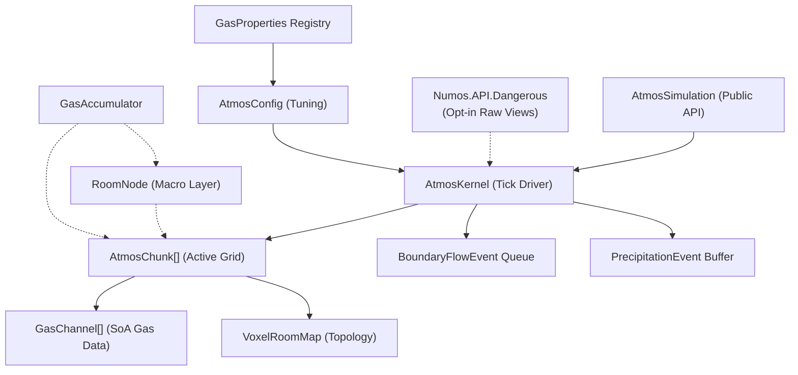

# Atmospherics System — Technical Documentation

> [!WARNING]
> This documentation is legacy and in parts does not reflect the current implementation (ex. thermal flow across chunk boundaries).

> **Revision**: 2026-07-12
> **Scope**: Engine-agnostic specification.
---

## Table of Contents

1. [Design Goals](#1-design-goals)
2. [Architecture Overview](#2-architecture-overview)
   - 2.1 [Public and Dangerous API Boundaries](#21-public-and-dangerous-api-boundaries)
3. [Data Model](#3-data-model)
   - 3.1 [Voxel Grid & Chunk](#31-voxel-grid--chunk)
   - 3.2 [Gas Channels (Structure of Arrays)](#32-gas-channels-structure-of-arrays)
   - 3.3 [Voxel Classification](#33-voxel-classification)
   - 3.4 [Room Nodes (Macro Layer)](#34-room-nodes-macro-layer)
   - 3.5 [Gas Properties Registry](#35-gas-properties-registry)
   - 3.6 [Configuration Parameters](#36-configuration-parameters)
4. [Simulation Loop](#4-simulation-loop)
   - 4.1 [Fixed Timestep Accumulator](#41-fixed-timestep-accumulator)
   - 4.2 [Phase 1 — Pressure Advection](#42-phase-1--pressure-advection)
   - 4.3 [Phase 2 — Cross-Chunk Boundary Flow](#43-phase-2--cross-chunk-boundary-flow)
   - 4.4 [Phase 3 — Thermodynamics](#44-phase-3--thermodynamics)
5. [Stability & Convergence Mechanisms](#5-stability--convergence-mechanisms)
   - 5.1 [CFL Flow Cap](#51-cfl-flow-cap)
   - 5.2 [Damping & Snap-to-Equilibrium](#52-damping--snap-to-equilibrium)
   - 5.3 [Minimum Flow Cutoff (Stiction)](#53-minimum-flow-cutoff-stiction)
   - 5.4 [Vacuum Cleanup](#54-vacuum-cleanup)
   - 5.5 [Delta Buffer (Order-Independence)](#55-delta-buffer-order-independence)
6. [Sleep System](#6-sleep-system)
7. [The Leaky Faucet Problem & GasAccumulator](#7-the-leaky-faucet-problem--gasaccumulator)
8. [Phase Changes (Condensation)](#8-phase-changes-condensation)
   - 8.1 [Clausius-Clapeyron Saturation Model](#81-clausius-clapeyron-saturation-model)
   - 8.2 [The Latent Heat Trap](#82-the-latent-heat-trap)
9. [Networking & Replication](#9-networking--replication)
10. [Known Flaws & Limitations](#10-known-flaws--limitations)
11. [Porting Guidance](#11-porting-guidance)

---

## 1. Design Goals

The system is built to simulate atmospheric gas dynamics in the context of a space-station or sealed-environment game. The core design priorities, as observable from the code, are:

1. **Performance over physical fidelity.** The simulation uses a simplified ideal gas law (`P = n * T`) with unit voxel volume rather than the full `PV = nRT` with real gas constants. This trades physical accuracy for speed and tunability.
2. **Work-proportional cost.** CPU cycles should be spent only on regions with active pressure gradients. Stable rooms should cost effectively zero.
3. **Engine independence.** The core simulation logic has no dependency on any specific game engine, rendering framework, or platform API. It is written as a standalone module that can be dropped into any engine's update loop.
4. **Multi-gas support.** The system tracks multiple independent gas species with distinct physical properties. Memory is allocated lazily per-gas, per-chunk.

---

## 2. Architecture Overview

The system uses a two-layer Level of Detail (LOD) model:

| Layer | Name | Granularity | Cost | When Active |
|-------|------|-------------|------|-------------|
| **Macro** | Room Node | Whole-room aggregate | O(1) per room | Room is at equilibrium (sleeping) |
| **Micro** | Atmos Chunk | Per-voxel cellular automata | O(n) per active voxel | Room has turbulent pressure gradients |

When a disturbance exceeds a configurable threshold (the "Threshold of Violence"), the macro-layer room transitions to the micro-layer voxel grid. When the voxel grid reaches equilibrium, it goes back to sleep and the macro layer resumes responsibility.

### Component Relationships



### 2.1 Public and Dangerous API Boundaries

Numos deliberately exposes two package-level integration surfaces:

| Package | Intended use | Compatibility                        | State access                                      |
|---------|--------------|--------------------------------------|---------------------------------------------------|
| `Numos.API` | Normal engine and game integration | Supported public contract            | Handles, validated operations, detached snapshots |
| `Numos.API.Dangerous` | Measured performance-critical code | No compatibility guarantee (for now) | No impl for now.                                  |

The dangerous package must be referenced separately and imported through `Numos.Dangerous`. Access begins with
`simulation.Dangerous()`.

The kernel hooks used by this package live in `AtmosKernel.Dangerous.cs`, keeping them distinct from the internal
operations that back the supported facade. `AtmosKernel`, `AtmosChunk`, and gas-channel representations remain
internal CLR types and are never returned directly from either package.

---

## 3. Data Model

### 3.1 Voxel Grid & Chunk

A chunk is a 3D grid of voxels, parameterized by `Width`, `Height`, and `Depth` (a common default is 16×16×16, or 4,096 voxels).

All per-voxel data is stored in flat 1D arrays indexed by:

```
index = x + (y * Width) + (z * Width * Height)
```

The inverse mapping is:

```
x = index % Width
y = (index / Width) % Height
z = index / (Width * Height)
```

Each chunk stores:

| Array | Type | Description |
|-------|------|-------------|
| `VoxelRoomMap` | `int[]` | Classifies each voxel (see §3.3) |
| `TotalPressure` | `float[]` | Cached pressure per voxel, recomputed each tick |
| `Temperature` | `float[]` | Temperature in Kelvin per voxel |
| `ActiveAirIndices` | `ushort[]` | Dense list of voxel indices belonging to the currently active room |
| `ActiveGases` | `GasChannel[]` | Sparse array of gas-specific mole data (see §3.2) |

Chunks are identified by an `Int3 GridPosition` in a spatial map (e.g. a `ConcurrentDictionary<Int3, AtmosChunk>`).

**Active Air Optimization**: The simulation never iterates over the full 4,096 voxels. When a room is woken, `WakeRoom(roomId)` scans the `VoxelRoomMap` and builds a dense list of indices (`ActiveAirIndices`) containing only voxels belonging to that room. All subsequent iteration uses this list, skipping solid geometry entirely.

> [!WARNING]
> **Single-room-per-chunk limitation**: A chunk can only have one `ActiveRoomId` at a time. If a chunk contains voxels from multiple rooms, calling `WakeRoom` with a different room ID overwrites the active list. The system does not simulate two rooms within the same chunk concurrently. This is a structural limitation that could cause issues in dense multi-room layouts.

### 3.2 Gas Channels (Structure of Arrays)

Each gas species present in a chunk is represented by a `GasChannel`:

```
struct GasChannel {
    int GasId;
    float[] Moles;  // Length = VoxelCount, rented from ArrayPool
}
```

Key properties:

- **Lazy allocation**: A `GasChannel` is only created when that gas type is first introduced to a chunk via `InjectGasToVoxel`. A chunk containing only oxygen will have one channel; a chunk containing oxygen, nitrogen, and plasma will have three.
- **ArrayPool rental**: The `Moles` array is rented from `System.Buffers.ArrayPool<float>` and cleared to zero on allocation. This avoids GC pressure from repeated allocations. The array must be explicitly returned via `Release()`.
- **Fixed capacity**: The `ActiveGases` array has a fixed capacity (default 16 slots). If more than 16 unique gas types are injected into a single chunk, the system throws an exception. There is no resize logic.

> [!NOTE]
> The `ArrayPool` may return an array larger than requested. Only the first `VoxelCount` entries are used. Implementations should clear only the requested range.

### 3.3 Voxel Classification

Each voxel in `VoxelRoomMap` is assigned an integer value that determines its behavior:

| Value | Constant | Behavior |
|-------|----------|----------|
| `0` | `RoomUnassigned` | Open, pressurizable volume not yet assigned to a room. Gas can exist here. |
| `> 0` | *(Room ID)* | Belongs to a specific named room. Participates in simulation when that room is awake. |
| `-1` | `RoomVoid` | Infinite sink / true vacuum. Gas entering this voxel is destroyed. Used for map boundaries or active vents. Pressure is always treated as 0. |
| `-2` | `RoomSolid` | Solid obstruction (wall/floor). Blocks gas flow completely. |

### 3.4 Room Nodes (Macro Layer)

When a room is at equilibrium (sleeping), it is represented by a `RoomNode`:

```
struct RoomNode {
    int RoomId;
    bool IsAsleep;
    int TotalVoxelVolume;
    float EquilibriumPressure;
    float AverageTemperature;
    float[] GasMoles;  // Total moles of each gas in the entire room
}
```

The `RoomNode` provides O(1) gas addition/removal using the ideal gas law:

- **AddGas**: Recalculates `AverageTemperature` as a mole-weighted average, then updates `EquilibriumPressure = TotalMoles * AverageTemperature / TotalVoxelVolume`.
- **RemoveGas**: Clamps removal to available moles, recalculates pressure. Temperature is not changed on removal (assumes uniform mixture).

> [!IMPORTANT]
> The `RoomNode` is defined with complete logic but is **not wired into the simulation loop**. `AtmosSimulation` operates exclusively at the voxel (micro) level. The `RoomNode` and `GasAccumulator` exist as data structures with complete logic, but the orchestration that transitions between macro and micro layers is not implemented. An integrator must build this transition logic.

### 3.5 Gas Properties Registry

Each gas species is defined by a `GasProperties` struct:

| Field | Type | Purpose |
|-------|------|---------|
| `Name` | `string` | Display name |
| `SpecificHeatCapacity` | `float` | Used in latent heat calculations during condensation |
| `BoilingPoint` | `float` | Temperature (K) above which the gas remains gaseous |
| `CondensationPoint` | `float` | Temperature (K) below which condensation can begin. In practice, used as a boolean gate (`> 0` means "this gas can condense") |
| `LatentHeatOfVaporization` | `float` | Energy released per mole during condensation |
| `LiquidId` | `int` | ID of the liquid this gas condenses into (for a separate liquid simulation system) |
| `DiffusionCoefficient` | `float` | Fickian diffusion rate for partial-pressure-driven mixing |

The registry is stored as a `List<GasProperties>` indexed by gas ID. Gas ID 0 is conventionally a placeholder/dummy entry.

### 3.6 Configuration Parameters

All tunable simulation parameters are centralized in a configuration object:

| Parameter | Default | Description |
|-----------|---------|-------------|
| `GlobalTemperature` | 293.15 | Reference ambient temperature (K). Not actively used in the simulation loop. |
| `DefaultTemperatureFallback` | 293.15 | Fallback when a voxel has 0 or uninitialized temperature. |
| `SpaceTemperature` | 2.7 | Temperature of space (K). Not actively used in the simulation loop. |
| `FlowFriction` | 0.25 | Fraction of pressure delta converted to flow per tick. The `k` constant. |
| `DampingFactor` | 0.5 | Multiplier applied to `FlowFriction` during large-delta advection to reduce oscillation. |
| `SnapThreshold` | 5.0 | Below this pressure delta, flow uses the CFL cap directly instead of `FlowFriction * DampingFactor`. |
| `MinFlowCutoff` | 0.1 | Flows below this magnitude are discarded ("stiction"). |
| `VacuumThreshold` | 1.0 | Below this pressure, voxel contents are zeroed out. |
| `SleepThreshold` | 100 | Consecutive ticks below `SleepEpsilon` before a chunk goes to sleep. |
| `SleepEpsilon` | 3.5 | Maximum pressure delta considered "at rest". |
| `ThermalConductivity` | 0.05 | Fraction of temperature delta transferred per neighbor per tick. |
| `CondensationRateFactor` | 0.5 | Rate multiplier for phase-change condensation. |
| `CflFlowCap` | 0.16 | Maximum fraction of a voxel's pressure that can flow to a single neighbor per tick (≈1/6 for 3D). |

---

## 4. Simulation Loop

### 4.1 Fixed Timestep Accumulator

The simulation runs on a fixed timestep, decoupled from the rendering frame rate:

```
SimulationRate = 20.0 Hz
FixedDt = 1 / SimulationRate = 0.05 seconds
MaxStepsPerFrame = 5
```

Each frame:
1. `elapsedSeconds` is added to an accumulator.
2. The accumulator is clamped to `FixedDt * MaxStepsPerFrame` to prevent a "spiral of death" when frame rate drops.
3. While the accumulator ≥ `FixedDt`, a simulation tick is consumed.

Each tick proceeds through three phases:

### 4.2 Phase 1 — Pressure Advection

This is the core fluid dynamics step. It runs in parallel across chunks.

**For each awake chunk:**

1. **Recalculate pressure**: For every active voxel, `TotalPressure[i] = TotalMoles[i] * Temperature[i]`. This is a simplified ideal gas law with unit volume (`V = 1`).

2. **Compute flow deltas**: For every active voxel, examine each Von Neumann neighbor (±X, ±Y, ±Z — 4 neighbors for 2D chunks, 6 for 3D):
   - Skip solid neighbors.
   - Treat void neighbors as pressure 0.
   - Calculate `pressureDelta = currentPressure - neighborPressure`.
   - If `pressureDelta > 0` (flow is outward):
     - If `pressureDelta < SnapThreshold`: use `flow = pressureDelta * CflFlowCap` (fast snap to equilibrium).
     - Else: use `flow = pressureDelta * FlowFriction * DampingFactor`.
     - Discard if `flow < MinFlowCutoff`.
     - Clamp: `flow = min(flow, currentPressure * CflFlowCap)`.
     - Convert flow to moles: `molesToMove = (flow / Temperature) * moleFraction` for each gas.
     - Accumulate into a flat delta buffer (not applied immediately).

3. **Fickian Diffusion**: In addition to bulk advection, a diffusion term based on concentration gradients is applied:
   ```
   deltaN = moles[src] - moles[neighbor] * (neighborTemp / srcTemp)
   molesDiffused = deltaN * DiffusionCoefficient
   ```
   This allows gases with different diffusion rates to mix even after bulk pressure has equalized. The Z-axis is checked conditionally, only when `Depth > 1`, allowing efficient 2D operation.

4. **Apply deltas**: After all voxels have been processed, the accumulated deltas are applied to the mole arrays. Values below 0.0001 are snapped to 0.

5. **Emit boundary events**: If a voxel is on the edge of the chunk (coordinate is 0 or `Size - 1`) and has pressure > 1.0, a `BoundaryFlowEvent` is emitted for cross-chunk processing.

### 4.3 Phase 2 — Cross-Chunk Boundary Flow

Boundary events are collected into a `ConcurrentQueue` during the parallel advection phase, then processed **sequentially** afterward.

For each boundary event:
1. Determine the source voxel's coordinates.
2. For each of the 6 directions, check if the neighbor coordinate is outside the chunk bounds.
3. If outside: look up the neighboring chunk at `GridPosition + direction`.
4. Map the out-of-bounds coordinate into the neighbor's local space using modular arithmetic: `nX = (targetX + neighborWidth) % neighborWidth`.
5. If the neighbor voxel is solid, skip. If the neighbor chunk is asleep, wake the target room.
6. Calculate pressure delta and flow using the same logic as intra-chunk advection (but using `FlowFriction` without the `DampingFactor` or snap logic).
7. Transfer moles directly (no delta buffer — this is sequential).

> [!WARNING]
> **Asymmetry between intra-chunk and cross-chunk flow**: The boundary flow uses a simpler flow formula (`pressureDelta * FlowFriction` capped by `CflFlowCap`) without the damping, snap-to-equilibrium, or minimum flow cutoff logic applied during intra-chunk advection. This means gas crossing chunk boundaries behaves differently from gas flowing within a chunk, which could produce visible seams at chunk edges under certain conditions.

### 4.4 Phase 3 — Thermodynamics

Thermodynamics runs at half frequency (every 2nd tick) to save computation. It consists of two sub-phases:

**Thermal Diffusion**: Heat transfers between adjacent voxels proportional to their temperature difference:
```
heatTransfer = (currentTemp - neighborTemp) * ThermalConductivity
```
Applied via a delta buffer to prevent directional bias. Vacuum voxels (pressure below `VacuumThreshold`) are excluded.

> [!IMPORTANT]
> Thermal diffusion is only processed within a single chunk. There is no cross-chunk thermal diffusion. Heat does not conduct across chunk boundaries.

**Phase Changes (Condensation)**: See §8.

---

## 5. Stability & Convergence Mechanisms

The advection loop is a first-order explicit cellular automaton, which is inherently prone to oscillation ("ringing") if flow per tick exceeds stability limits. The system employs several interlocking mechanisms to ensure convergence.

### 5.1 CFL Flow Cap

The CFL (Courant–Friedrichs–Lewy) condition limits how much pressure a single voxel can donate to a single neighbor per tick. In a 3D grid with 6 neighbors, a voxel could donate to all 6 simultaneously. To prevent total outflow from exceeding the voxel's contents:

```
MaxOutflowPerNeighbor ≤ TotalPressure * CflFlowCap
```

The default `CflFlowCap = 0.16 ≈ 1/6` ensures that even if all 6 neighbors receive flow simultaneously, total outflow does not exceed ~96% of the voxel's pressure. This prevents negative mole counts and the resulting simulation instability.

Design note: a naive cap of 0.5 is unstable for more than 2 neighbors (0.5 * 6 = 3.0 > 1.0); 0.16 (≈1/6) keeps the system within the CFL stability limit for a 3D grid.

### 5.2 Damping & Snap-to-Equilibrium

Two regimes are used depending on the magnitude of the pressure delta:

- **Large delta** (`pressureDelta ≥ SnapThreshold`): `flow = pressureDelta * FlowFriction * DampingFactor`. The `DampingFactor` (0.5) reduces the effective flow rate to kill ringing in high-energy scenarios.
- **Small delta** (`pressureDelta < SnapThreshold`): `flow = pressureDelta * CflFlowCap`. This bypasses the friction model entirely and snaps the voxel toward equilibrium at the maximum stable rate.

### 5.3 Minimum Flow Cutoff (Stiction)

Flows below `MinFlowCutoff` (0.1) are discarded entirely. This prevents infinitesimal flows from keeping a chunk awake indefinitely and accelerates convergence by eliminating micro-oscillations.

### 5.4 Vacuum Cleanup

Voxels with `TotalPressure < VacuumThreshold` (1.0) have all gas moles zeroed out. This prevents the accumulation of trace gas amounts that would otherwise never fully equalize and would keep chunks awake.

### 5.5 Delta Buffer (Order-Independence)

Mole transfers within a chunk are not applied directly during the neighbor scan. Instead, they are accumulated into a rented `float[]` delta buffer (one slot per gas per voxel). After all voxels have been scanned, the deltas are applied in a single pass. This eliminates order-dependent bias: the result is the same regardless of which voxel is processed first.

The delta buffer is rented from `ArrayPool<float>` and returned after application.

> [!NOTE]
> Cross-chunk boundary flow does **not** use a delta buffer. Transfers are applied immediately during sequential processing. This is acceptable given the sequential nature of boundary processing, but it does introduce a minor order dependency between boundary events.

---

## 6. Sleep System

Each chunk maintains a `SleepTimer` counter. After each advection pass:

1. The maximum pressure delta across all neighbor pairs in the chunk (`maxPressureDelta`) is tracked.
2. If `maxPressureDelta < SleepEpsilon` (3.5): increment `SleepTimer`.
3. If `SleepTimer > SleepThreshold` (100): set `IsAwake = false`. The chunk ceases all processing.
4. If `maxPressureDelta ≥ SleepEpsilon`: reset `SleepTimer` to 0.

A sleeping chunk is woken when:
- `InjectGasToVoxel` is called on it (the sleep timer is reset).
- A boundary flow event targets one of its voxels (the target room is woken via `WakeRoom`).

The sleep system is the primary mechanism for achieving the "work-proportional cost" goal. In a station with 500 chunks, only the handful with active pressure gradients consume CPU.

Unit tests confirm convergence to sleep for L-shaped, donut-shaped, and zigzag room geometries, with pressure equilibrating to within 1.0 moles of the average across all voxels.

---

## 7. The Leaky Faucet Problem & GasAccumulator

### The Problem

A slow, continuous gas leak (e.g., a cracked pipe) produces a flow rate below the "Threshold of Violence" that would wake the voxel grid. Without mitigation, there are two bad outcomes:
1. **Wake the grid every tick**: The voxel simulation runs continuously for a negligible leak, wasting CPU.
2. **Ignore it**: The leak is never simulated, producing incorrect atmospheric state.

### The Solution: GasAccumulator

The `GasAccumulator` acts as a buffer between a gas source and the simulation:

```
struct GasAccumulator {
    int GasId;
    float AccumulatedMoles;
    float OutputTemperature;  // Mole-weighted running average
    int TicksAlive;
    const int MaxAliveTimeBeforeReset = 20;
}
```

Each tick, the leaking source calls `AddGas(moles, temperature)`, which accumulates mass and tracks a weighted-average temperature.

The caller then evaluates the accumulator state:

```
EvaluateState(currentPressureDelta, wakeThreshold) → Hold | Diffuse | Inject
```

| State | Condition | Action |
|-------|-----------|--------|
| **Hold** | Delta < threshold AND ticks < max | Continue accumulating. Do nothing. |
| **Diffuse** | Delta < threshold AND ticks ≥ max (20) | Release accumulated gas into the `RoomNode` (macro layer). The leak is too slow to matter at the voxel level. |
| **Inject** | Delta ≥ threshold | Wake the chunk and inject accumulated gas into the voxel grid (micro layer). The leak has built up enough pressure to warrant full simulation. |

After either `Diffuse` or `Inject`, the accumulator is reset.

Unit tests confirm:
- A 0.5 kPa delta holds.
- A 5.0 kPa delta after 20 ticks diffuses to the macro layer.
- A 150.0 kPa spike injects immediately.

> [!IMPORTANT]
> As with the `RoomNode`, the `GasAccumulator` is **fully implemented as a data structure** but is **not wired into the simulation loop**. `AtmosSimulation` does not reference it. An integrator must build the orchestration that feeds gas sources into accumulators and dispatches the resulting `Diffuse` or `Inject` actions. The unit tests for `GasAccumulator` test the struct in isolation.

---

## 8. Phase Changes (Condensation)

### 8.1 Clausius-Clapeyron Saturation Model

Condensation is modeled using a saturation-vapor-pressure approach based on the Clausius-Clapeyron equation:

```
P_sat = P_reference * exp(-LatentHeat * (1/T - 1/T_boiling))
```

Where `P_reference = 1000.0` (a reference pressure scale, not atmospheric pressure).

Condensation occurs when partial pressure exceeds saturation:

```
currentPartialPressure = gasMoles * Temperature
if (currentPartialPressure > P_sat):
    excessPressure = currentPartialPressure - P_sat
    molesToCondense = (excessPressure / Temperature) * CondensationRateFactor
```

This model allows condensation to occur at any temperature where the gas is supersaturated, rather than only below a fixed boiling point.

### 8.2 The Latent Heat Trap

Condensation releases latent heat back into the local voxel:

```
tempIncrease = (molesToCondense * LatentHeatOfVaporization) / SpecificHeatCapacity
Temperature[idx] += tempIncrease
```

This creates a negative feedback loop. As gas condenses, the voxel warms, which raises the saturation pressure, which slows further condensation. This prevents runaway condensation from instantly removing all gas from a cold voxel.

### Output: PrecipitationEvent

Condensed gas is packaged into a `PrecipitationEvent`:

```
struct PrecipitationEvent {
    ushort LocalVoxelIndex;
    int LiquidID;
    float MolesToSpawn;
    float InheritedTemp;
}
```

These events are written to a thread-local buffer and are intended to be consumed by a separate liquid simulation system. That liquid system is not part of this codebase.

---

## 9. Networking & Replication

The reference implementation includes stubs and data structures for network synchronization, but the networking logic itself is not implemented.

### Snapshot Replication

`AtmosChunkSnapshot` is a full-fidelity copy of a chunk's state:

```
struct AtmosChunkSnapshot {
    Int3 GridPosition;
    float[] TotalPressure;   // 4096 floats
    float[] Temperature;     // 4096 floats
    GasSnapshot[] Gases;     // Per-gas mole arrays
    int[] VoxelRoomMap;      // 4096 ints
}
```

A helper class `AtmosNetworkCompression` provides 8-bit quantization for pressure values (0–1000 range mapped to 0–255), but comments note this is unused and full float data is currently synced.

### Network Events

`GasInjectionEvent` is defined for replicating sudden gas injections (explosions, tank ruptures):

```
struct GasInjectionEvent {
    Vector3 Position;
    int GasId;
    float Moles;
    float Temperature;
}
```

The `AtmosNetworkManager` contains method stubs for:
- Sending injection events to the server.
- Server-side RPC handling (world position → chunk/voxel mapping, then `InjectGasToVoxel`).
- Client-side visual/audio response.

All networking methods are stubs with comments indicating where real implementation would go.

---

## 10. Known Flaws & Limitations

### Structural

1. **Single active room per chunk.** `WakeRoom` can only activate one room at a time. A chunk containing voxels from two different rooms cannot simulate both simultaneously. This requires either careful spatial partitioning to avoid multi-room chunks, or extending the system to support multiple active room indices per chunk.

2. **Macro-micro transition not implemented.** The `RoomNode`, `GasAccumulator`, and the transition logic between macro (sleeping room) and micro (active voxel grid) layers are defined as data structures but are not orchestrated by the simulation loop. An integrator must implement: (a) how a sleeping room's aggregate state seeds the voxel grid on wake, (b) how a sleeping voxel grid's state is collapsed back into a `RoomNode`, and (c) how `GasAccumulator` feeds into this process.

3. **No cross-chunk thermal diffusion.** Heat only conducts between voxels within the same chunk. At chunk boundaries, temperature gradients are invisible to the thermal diffusion pass. This could produce thermal discontinuities at chunk edges.

### Numerical

4. **Asymmetric boundary flow formula.** Cross-chunk boundary flow uses `pressureDelta * FlowFriction` (no damping, no snap threshold, no stiction cutoff), while intra-chunk flow applies damping, snap, and stiction. This asymmetry can produce different flow rates across a chunk boundary versus within a chunk for identical pressure deltas.

5. **Unidirectional flow in advection.** The advection loop only processes flow from high pressure to low (`pressureDelta > 0`). Due to the delta buffer, this is correct for order-independence but means each voxel-pair interaction is computed once (from the higher-pressure side). The thermal diffusion loop has the same unidirectional guard (`tempDelta > 0`), and it applies symmetric deltas (subtracts from source, adds to neighbor). However, because both voxels are iterated and both will compute their own outward deltas to different neighbors, a pair can be processed twice if both sides iterate — once from each direction. The thermal diffusion delta buffer prevents this from causing instability but it does mean some pairs contribute double the intended heat transfer.

6. **Temperature weighting on injection.** `InjectGasToVoxel` computes a weighted average temperature: `newTemp = ((existingMoles * existingTemp) + (newMoles * newTemp)) / totalMoles`. If `existingTemp` is 0 (uninitialized) and existing moles are non-zero, this will dilute the incoming temperature toward zero. The fallback temperature (`DefaultTemperatureFallback`) is applied only during pressure calculation, not during injection.

### Performance

7. **Per-tick chunk snapshot via `.ToArray()`.** Each tick, the simulation calls `_chunkMap.Values.ToArray()` to snapshot the chunk collection. This allocates a new array every tick. For large chunk counts at 20 Hz, this generates significant GC pressure.

8. **Thread-local buffer overflow.** The `BoundaryFlowEvent` and `PrecipitationEvent` thread-local buffers are fixed at 64 entries. If a chunk has more than 64 boundary voxels with pressure > 1.0, excess events are silently dropped. For a 16×16×16 chunk, the boundary surface is up to 1,536 voxels (6 faces × 256), so 64 is insufficient in the worst case.

---

## 11. Porting Guidance

To implement this system in another engine or language, start from the core module described in this document:
- `AtmosSimulation` — the supported public facade.
- `AtmosKernel` — the internal tick driver and physics implementation.
- `AtmosChunk` — the parameterized voxel grid.
- `AtmosConfig` — all tunable parameters.
- `GasChannel`, `GasProperties`, `RoomNode` — all data structures.
- `Types.cs` — standalone `Int3`, `Vector3`, event structs.

### What to build

| Component | Status | Action Required |
|-----------|--------|-----------------|
| Tick driver integration | ✅ Complete | Call `AtmosSimulation.Update(deltaSeconds)` from your engine's update loop. |
| Chunk lifecycle | ✅ Complete | Call `CreateAndRegisterChunk` / `UnregisterChunk`; chunks remain owned by the simulation. |
| Voxel topology | ✅ API provided | Populate topology through `SetChunkClassification` and `SetVoxelClassification`. |
| Room detection | ❌ Not provided | You must implement flood-fill or connected-component analysis to assign room IDs to contiguous open volumes in `VoxelRoomMap`. |
| Macro-micro transition | ❌ Not provided | You must implement the logic that seeds voxel grids from `RoomNode` state on wake, and collapses back on sleep. |
| GasAccumulator orchestration | ❌ Not provided | You must implement the per-source accumulator loop and dispatch `Diffuse`/`Inject` actions. |
| Gas source API | ✅ API provided | Use `AddGasToVoxel` for game-side sources such as pipes, vents, and fires. |
| Liquid system | ❌ Not provided | `PrecipitationEvent` is produced but never consumed. Build a liquid simulation if needed. |
| Visualization | ❌ Not provided | Pressure, temperature, and gas composition are available per-voxel. You must build rendering (overlays, particle effects, fog). |
| Networking | ❌ Snapshot only | `AtmosChunkSnapshot` is exposed, but serialization, transport, and client reconciliation are not implemented. |

### Parallelism

The simulation assumes parallel execution:
- **Intra-chunk advection and thermodynamics** are dispatched in parallel across chunks (e.g. via a `Parallel.ForEach`-style construct).
- **Boundary flow** is sequential and must remain so to avoid race conditions when two chunks write to each other's voxels.
- **Thread-local buffers** (`ThreadLocal<T>`) are used for boundary and precipitation events to avoid contention.

If your target platform does not support threading (e.g., single-threaded WASM), the simulation will still function correctly when run sequentially — the parallel regions have no ordering dependencies within them.

### Memory

At 16×16×16 with one gas:
- Per chunk: `4096 * 4 bytes * 4 arrays` (VoxelRoomMap, TotalPressure, Temperature, ActiveAirIndices) + `4096 * 4 bytes` (one GasChannel) ≈ **80 KB**.
- Per additional gas: +16 KB.
- 512 chunks (8×8×8 grid): ≈ **40 MB** base.

`ArrayPool` rental means actual memory footprint depends on pool behavior. Arrays may be larger than requested and may persist in the pool after `Release()`.
