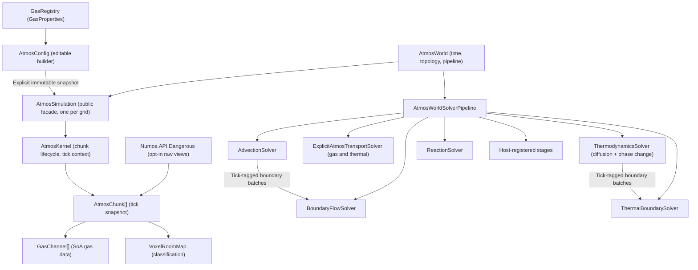

# Numos Atmospherics: Physical Model and Architecture

This is the engine-agnostic reference for how Numos stores atmospheric state, advances it each tick, and keeps the
result stable and deterministic. Pressure, thermodynamics, phase changes, and energy transfer use explicit SI units
throughout: pascals, kelvins, moles, joules, and cubic metres.

> **Revision**: 2026-10-04

---

## Table of Contents

1. [Design Goals](#1-design-goals)
2. [Architecture](#2-architecture)
    - [Why interacting simulations share a world](#why-interacting-simulations-share-a-world)
    - [Explicit topology: portals, docks, and links beyond the grid](#explicit-topology-portals-docks-and-links-beyond-the-grid)
    - [How the Viewer presents a world](#how-the-viewer-presents-a-world)
    - [How explicit transport fits into a tick](#how-explicit-transport-fits-into-a-tick)
    - [Writing a custom solver that touches portals](#writing-a-custom-solver-that-touches-portals)
    - [How the pieces connect](#how-the-pieces-connect)
   - 2.1 [Public and Dangerous API Boundaries](#21-public-and-dangerous-api-boundaries)
3. [Data Model](#3-data-model)
   - 3.1 [Voxel Grid & Chunk](#31-voxel-grid--chunk)
   - 3.2 [Gas Channels (Structure of Arrays)](#32-gas-channels-structure-of-arrays)
   - 3.3 [Voxel Classification](#33-voxel-classification)
   - 3.4 [Gas Properties Registry](#34-gas-properties-registry)
   - 3.5 [Configuration Parameters](#35-configuration-parameters)
   - 3.6 [Container and Voxel Gas Mixtures](#36-container-and-voxel-gas-mixtures)
4. [Simulation Loop](#4-simulation-loop)
   - 4.1 [Fixed Timestep Accumulator](#41-fixed-timestep-accumulator)
   - 4.2 [Solver Pipeline](#42-solver-pipeline)
   - 4.3 [Pressure Advection](#43-pressure-advection)
   - 4.4 [Cross-Chunk Boundary Flow](#44-cross-chunk-boundary-flow)
   - 4.5 [Thermodynamics and Thermal Boundaries](#45-thermodynamics-and-thermal-boundaries)
5. [Stability & Convergence Mechanisms](#5-stability--convergence-mechanisms)
   - 5.1 [Bulk-Flow Coefficient](#51-bulk-flow-coefficient)
   - 5.2 [Shared Conductance Limiter](#52-shared-conductance-limiter)
   - 5.3 [Vacuum Cleanup](#53-vacuum-cleanup)
   - 5.4 [Delta Buffers and Reduction Order](#54-delta-buffers-and-reduction-order)
   - 5.5 [Where Numos Uses Double Precision](#55-where-numos-uses-double-precision)
6. [Sleep System](#6-sleep-system)
7. [Phase Changes (Condensation)](#7-phase-changes-condensation)
    - 7.1 [Clausius-Clapeyron Saturation Model](#71-clausius-clapeyron-saturation-model)
    - 7.2 [Phase-Change Internal-Energy Balance](#72-phase-change-internal-energy-balance)
8. [Networking & Replication](#8-networking--replication)
9. [Known Flaws & Limitations](#9-known-flaws--limitations)
10. [Porting Guidance](#10-porting-guidance)

---

## 1. Design Goals

Numos simulates atmospheric gas dynamics for a space-station or sealed-environment game. Its priorities are:

1. **Performance with auditable units.** The simulation uses the ideal-gas law `P = nRT/V` with one configurable,
   uniform voxel volume. Pressure is stored in pascals, temperature in kelvins, amount in moles, and sensible energy in
   joules. The cellular flow model is a game-oriented approximation, not a Navier–Stokes solver.
2. **Work-proportional cost.** CPU time goes to regions with active pressure gradients. Stable rooms should cost
   effectively nothing.
3. **Engine independence.** The core has no dependency on a game engine, rendering framework, or platform API. It is a
   standalone module driven from any engine's update loop.
4. **Multi-gas support.** Numos tracks any number of gas species with distinct physical properties. Memory is
   allocated lazily per gas, per chunk.

---

## 2. Architecture

### Why interacting simulations share a world

`AtmosWorld` is the root of an interacting atmospheric system. It owns fixed-step time, one shared immutable physics
configuration, stable simulation registrations, the solver pipeline, and sparse topology. Each `AtmosSimulation` is a
separate storage domain whose chunks have exactly one owner. The single-argument `AtmosSimulation` constructor creates
a private one-simulation world for convenience; multi-grid integrations create their simulations through a shared
world.

### Explicit topology: portals, docks, and links beyond the grid

Most of a station's atmosphere is a plain 3D grid, and Numos never stores the fact that one voxel sits next to another
— ±X/±Y/±Z adjacency is implicit, computed from chunk coordinates on demand. That works because the grid is Euclidean:
given a coordinate, arithmetic tells you the neighbors.

A door between two docked ships breaks that assumption. The voxel on one side and the voxel on the other aren't
Cartesian neighbors of anything — they can be on opposite ends of the map, or in a completely different
`AtmosSimulation` with its own coordinate system. Numos calls this general case an **explicit link**: an undirected,
value-type edge between two `AtmosCellRef`s, held in a sparse overlay on `AtmosWorld` instead of being inferred from
geometry. `CreatePortal`, `CreateDock`, and `CreateLinks` are three constructors over the same edge representation —
a portal is a one-edge link set, a dock is a link set covering a whole mated surface, and `CreateLinks` is the batch
API the other two are built on. `ExplicitLinkSetKind` just records which constructor made a given batch, purely so
tooling and replay can tell a portal from a dock; it has no effect on how the edge behaves physically.

Every link carries `ExplicitLinkFlags` deciding what is allowed to cross it. `GasTransport` and `ThermalTransport` are
the two bits Numos' own built-in stages look for; the rest of that `byte` is reserved for hosts (see
[Extending portal and dock transport](#extending-portal-and-dock-transport)). A link must carry at least one bit —
`ExplicitLinkFlags.None` is rejected — but a link with only host-defined bits is fine. It's inspectable, checkpointed,
and shows up in topology enumeration; it just carries nothing through Numos' default gas or heat solvers, which is
exactly what you want for a connection a custom solver owns entirely.

Creating or destroying a link is queued, not immediate: it lands at the next tick boundary, when `TopologyVersion`
advances. That's the same reason chunk registration is queued — a tick is already iterating a fixed set of chunks and
edges, and inserting one mid-traversal would make solver results depend on when exactly you called `CreatePortal`
relative to the current tick. Endpoint order is canonicalized on registration, so `CreatePortal(a, b)` and
`CreatePortal(b, a)` are the same edge, and a physical pair of cells can only be linked once — Numos rejects a second
edge between the same two voxels, and rejects a link that would duplicate an ordinary Cartesian neighbor (a portal
between two cells that are already next to each other would just be redundant plumbing). Generational simulation and
link-set IDs mean a handle to a removed portal fails loudly instead of silently reattaching to whatever reused that
storage slot next. Activating a link wakes both endpoint chunks immediately, so a pressurized room on the far side of
a portal can't hide behind a peer that happened to be asleep.

### How the Viewer presents a world

The Viewer presents every registered simulation in its own dockable 3D surface with an independent camera. One active
simulation supplies the shared 2D slice and editing panels. Its World & Topology panel creates or removes simulations,
captures two selected voxels for portals, and maps complete rectangular chunk faces into docks with quarter-turn and
axis-flip controls.

Inter-simulation connections use matching colored endpoint markers; intra-simulation connections also draw a local line.
These displays do not imply shared chunk ownership. Every chunk still belongs to exactly one simulation, and a dock
remains a sparse batch of cell links.

### How explicit transport fits into a tick

A world tick captures every simulation pipeline before running any callback, then advances every simulation through its
advection barrier, applies explicit gas transport once across the compiled world edge set, advances every simulation
through thermodynamics, and applies explicit thermal transport on the same cadence. Later stages — including any
custom ones — therefore always see the completed result of both transport passes, never a partially-applied one.
Registration order cannot decide which endpoint of a link updates first, because the explicit solver computes every
edge's request before committing any of them (the next section explains why that matters for your own solver too).

Explicit links interact with sleep the same way Cartesian boundaries do; see [Sleep System](#6-sleep-system).

### Writing a custom solver that touches portals

If your custom stage needs to see explicit links at all, register it with `RegisterNeighborSolver` (or the `Before`/
`After` variants), not the plain `Register`. A stage registered without a selection gets an *empty* topology view —
`context.Topology.GetOwnedEdges()` silently returns nothing, and `GetNeighbors(cell)` returns no explicit neighbors —
there is no exception to tell you a portal-aware stage forgot to ask for one:

```csharp
world.Solvers.RegisterNeighborSolverAfter(
    AtmosBuiltInSolvers.Advection,
    "game/custom-portal-gas",
    new AtmosNeighborSelection(
        "game/custom-portal-gas/v1",
        includeCartesian: false,
        static link => (link.Flags & ExplicitLinkFlags.GasTransport) != 0),
    context =>
    {
        foreach (AtmosNeighborEdge edge in context.Topology.GetOwnedEdges())
        {
            // edge.First and edge.Second are the two AtmosCellRef endpoints of one portal or dock link.
        }
    });
```

`AtmosNeighborSelection` has two knobs, and picking the wrong one is the most common mistake:

- `includeCartesian` adds every ordinary ±X/±Y/±Z neighbor to the compiled view alongside explicit links. Set it to
  `false` for a solver that only ever cares about portals and docks — that's the example above, and it's what keeps
  `GetOwnedEdges()` cheap: with Cartesian adjacency excluded, the view only walks the sparse explicit edge list instead
  of every voxel in every chunk. Set it to `true` only when the same interaction genuinely needs to travel through
  ordinary walls too, like fire or sound spreading through both open doorways and portals (see
  [Use portals from a custom solver](using.md#use-portals-from-a-custom-solver) for that shape).
- The `explicitLinks` selector decides which links are "yours." Numos calls it once per link, only when topology or
  solver registration changes — never per tick — so it must be a pure function of the link's `Flags` and endpoints,
  with no captured per-tick state. This is also why `ExplicitLinkFlags` reserves bits beyond `GasTransport`/
  `ThermalTransport`: give a link a host-defined bit and your selector alone can pick it out, letting one link opt in
  or out of your interaction independently of Numos' own physics.

The selection's `Key` string is not just a label — it's checkpointed as part of that solver's registration and folded
into world state hashing, so two builds that use the same key must agree on what the selector matches. Bump the key
(`"v1"` → `"v2"`) when you change what a selection includes; reusing an old key for a semantically different selection
makes a restored checkpoint compile the wrong topology for it.

`GetOwnedEdges()` is a convenience: it re-derives current chunk membership on every call and visits each physical
adjacency exactly once, which is the right shape for a *conservative* transfer — something moved from one endpoint
must be removed from it and added to the other, exactly once, regardless of which endpoint you started from. A
performance-sensitive tiled solver should instead call `context.Topology.GetChunk(simulation, chunk)` once per chunk
and then `GetNeighbors(voxelIndex)` per voxel — an allocation-free enumerable — which avoids re-deriving chunk
membership on every voxel the way a fresh `GetOwnedEdges()` call would.

The compiled topology only describes structural adjacency, so two obligations stay with you:

- **Solid and void cells still appear as neighbors.** A portal endpoint sitting in a wall or a vacuum voxel is still a
  valid edge in `GetOwnedEdges()` — Numos' own transport stages check `VoxelRoomMap` before moving anything, and a
  custom stage needs the same guard, or it will happily inject gas into a solid voxel.
- **Waking is your job.** If your stage mutates gas or heat through `Numos.API.Dangerous` (see
  [2.1](#21-public-and-dangerous-api-boundaries)), call `Wake()` on every chunk you changed. Nothing else notices a raw
  span write; a chunk that was asleep before your mutation stays marked asleep afterward unless you wake it, so its
  new pressure never gets re-evaluated.

If your stage moves gas or energy across a link rather than just reading, treat a cell with multiple explicit
neighbors the way the built-in stage does: compute every edge's request from one unchanged snapshot of the tick's
starting state, apply a single shared limiter per `(cell, gas)` pair so the sum of everything leaving a cell this tick
can never exceed what it had, and only then write the results. A cell can have any number of portals attached to it
(a Cartesian voxel has at most six neighbors), so a naive "read one edge, write it, move to the next edge" loop lets
whichever edge happens to run first drain a shared cell dry and starve every edge after it. The result then depends on
edge iteration order, which is exactly the kind of order-dependence Numos' determinism contract forbids. See
[Extending portal and dock transport](#extending-portal-and-dock-transport) for how to replace or layer on top of the
built-in stages instead of writing this from scratch.

### How the pieces connect


```mermaid
graph TD
    WORLD["AtmosWorld (time, topology, pipeline)"] --> PIPE["AtmosWorldSolverPipeline"]
    WORLD --> SIM["AtmosSimulation (public facade, one per grid)"]
    SIM --> KERNEL["AtmosKernel (chunk lifecycle, tick context)"]
    DANGER["Numos.API.Dangerous (opt-in raw views)"] --> CHUNKS
    PIPE --> ADV["AdvectionSolver"]
    PIPE --> EXPL["ExplicitAtmosTransportSolver (gas and thermal)"]
    PIPE --> BOUNDARY["BoundaryFlowSolver"]
    PIPE --> THERMO["ThermodynamicsSolver (diffusion + phase change)"]
    PIPE --> THERMAL["ThermalBoundarySolver"]
    PIPE --> REACT["ReactionSolver"]
    PIPE --> CUSTOM["Host-registered stages"]
    KERNEL --> CHUNKS["AtmosChunk[] (tick snapshot)"]
    ADV -->|"Tick-tagged boundary batches"| BOUNDARY
    THERMO -->|"Tick-tagged boundary batches"| THERMAL
    CHUNKS --> GAS["GasChannel[] (SoA gas data)"]
    CHUNKS --> ROOM["VoxelRoomMap (classification)"]
    CONFIG["AtmosConfig (editable builder)"] -->|"Explicit immutable snapshot"| SIM
    REG["GasRegistry (GasProperties)"] --> CONFIG
```

### 2.1 Public and Dangerous API Boundaries

Numos exposes two package-level integration surfaces:

| Package | Intended use | Compatibility                        | State access                                      |
|---------|--------------|--------------------------------------|---------------------------------------------------|
| `Numos.API` | Normal engine and game integration | Supported public contract            | Handles, validated operations, detached snapshots |
| `Numos.API.Dangerous` | Measured performance-critical solver code | No compatibility guarantee (for now) | Handle-addressed live spans and unchecked state views |

The dangerous package must be referenced separately and imported through `Numos.API.Dangerous`. Access begins with
`simulation.Dangerous()`. Every custom solver is registered through `simulation.World.Solvers` and receives an
`AtmosWorldSolverContext`. Most solvers use its simulations' detached snapshots and validated mutations; a measured hot
path can call `simulation.Dangerous().GetChunk(handle)` from that callback to obtain stack-scoped live chunk and
gas-channel spans.

Validated mutations keep pressure and heat-capacity caches, active-voxel indices, sleep state, and observable
revisions coherent. Use the dangerous package only when a solver must traverse or mutate backing storage directly and
can maintain those coupled invariants itself. The dangerous views are `ref struct` values and never expose the internal
`AtmosChunk` or `GasChannel` CLR types. They are safest inside a solver callback, where the simulation already prevents
concurrent tick and chunk-lifecycle operations.

---

## 3. Data Model

### 3.1 Voxel Grid & Chunk

A chunk is a 3D grid of voxels, parameterized by `Width`, `Height`, and `Depth` (the default is 16×16×16, or 4,096
voxels; `AtmosChunkConstants.MaximumVoxelCount` caps a chunk at 65,535 so voxel indices fit in a `ushort`).

All per-voxel data is stored in flat 1D arrays indexed by:

```
index = x + (y * Width) + (z * Width * Height)
```

The inverse mapping is:

```
x = index % Width
y = (index / Width) % Height
z = index / (Width * Height)
```

Each chunk stores:

| Array               | Type           | Description                                                                                               |
|---------------------|----------------|-----------------------------------------------------------------------------------------------------------|
| `VoxelRoomMap`      | `int[]`        | Classifies each voxel (see §3.3)                                                                          |
| `TotalPressure`     | `float[]`      | Cached pressure per voxel in pascals (Pa), recalculated at advection start and refreshed as state changes |
| `Temperature`       | `float[]`      | Temperature in kelvins (K) per voxel                                                                      |
| `TotalHeatCapacity` | `float[]`      | Cached total heat capacity per voxel, in J/K                                                              |
| `IsVacuum`          | `bool[]`       | Marks gasless voxels; vacuum voxels are skipped by thermal conduction                                     |
| `ActiveAirIndices`  | `ushort[]`     | Dense list of non-solid, non-void voxel indices in an awake chunk                                         |
| `ActiveGases`       | `GasChannel[]` | Sparse array of gas-specific mole data (see §3.2)                                                         |

Each voxel's heat capacity, sensible energy, and pressure follow from its composition. Every gas uses an effective
molar heat capacity at constant volume, falling back to a configured default when the registry has no usable value:

```
c_fallback = isFinite(DefaultMolarHeatCapacityAtConstantVolume) && DefaultMolarHeatCapacityAtConstantVolume > 0
    ? DefaultMolarHeatCapacityAtConstantVolume
    : 5R/2
c_effective = gasIsRegistered && isFinite(MolarHeatCapacityAtConstantVolume) && MolarHeatCapacityAtConstantVolume > 0
    ? MolarHeatCapacityAtConstantVolume
    : c_fallback
C_voxel = sum(moles[g] * c_effective[g])
E_voxel = C_voxel * effectiveTemperature
P_voxel = totalMoles * R * effectiveTemperature / VoxelVolume
```

`C_voxel` is a total heat capacity in J/K, not a molar heat capacity. `E_voxel` is the sensible internal energy of the
voxel, which is why the model uses constant-volume heat capacity (`C_v`) rather than constant-pressure heat capacity
(`C_p`). `R` is the molar gas constant (`8.31446262 J/(mol·K)`, per the
[NIST reference value](https://physics.nist.gov/cgi-bin/cuu/Value?r)) and `VoxelVolume` is in m³, so `P_voxel` is in
pascals. `DefaultMolarHeatCapacityAtConstantVolume` defaults to the ideal-diatomic `5R/2` (`20.786... J/(mol·K)`).

The heat-capacity cache is recalculated or updated whenever gas composition changes. When a gas-bearing voxel's stored
temperature is non-finite or nonpositive, pressure and energy calculations use `DefaultTemperatureFallback` as the
effective temperature (an invalid fallback is normalized to `293.15 K`). The next energy update then stores its own
blended, diffused, or phase-change temperature.

Chunks are keyed by an `Int3 GridPosition` in a `ConcurrentDictionary<Int3, AtmosChunk>` owned by the simulation's
kernel.

**Active air list.** Physics loops iterate the dense `ActiveAirIndices` list rather than every voxel. Waking a chunk
rebuilds the list by scanning all `VoxelCount` entries and keeping every non-solid, non-void voxel. The rebuild is
O(`VoxelCount`) (4,096 entries for a default chunk); everything after it is proportional to the active list.

### 3.2 Gas Channels (Structure of Arrays)

Each gas species present in a chunk is represented by a `GasChannel`:

```
struct GasChannel {
    int GasId;
    float[] Moles;  // Length >= VoxelCount, rented from ArrayPool
}
```

- **Lazy allocation**: a channel is created the first time a gas is written to a chunk. A chunk containing only oxygen
  has one channel; a chunk containing oxygen, nitrogen, and plasma has three.
- **ArrayPool rental**: `Moles` is rented from `ArrayPool<float>.Shared` and the first `VoxelCount` entries are cleared.
  The pool may hand back a longer array; only the first `VoxelCount` entries are meaningful. `Release()` returns it.
- **Growable channel table**: `ActiveGases` starts with `AtmosChunkConstants.InitialGasChannelCapacity` slots (16) and
  doubles only when another distinct gas ID reaches the chunk. Existing per-gas arrays stay where they are, so the
  structure-of-arrays layout survives arbitrary gas IDs and counts.

### 3.3 Voxel Classification

Each voxel in `VoxelRoomMap` holds an integer that determines its behavior:

| Value | Constant              | Behavior                                                                                                                                     |
|-------|-----------------------|----------------------------------------------------------------------------------------------------------------------------------------------|
| `0`   | `RoomUnassigned`      | Open, pressurizable volume. Gas can exist here.                                                                                              |
| `> 0` | *(classification ID)* | Open, pressurizable volume. IDs are retained as topology metadata and do not partition solver work.                                          |
| `-1`  | `RoomVoid`            | Infinite sink / true vacuum. Gas entering this voxel is destroyed. Used for map boundaries or active vents. Pressure is always treated as 0. |
| `-2`  | `RoomSolid`           | Solid obstruction (wall/floor). Blocks gas flow and conduction completely.                                                                   |

### 3.4 Gas Properties Registry

Each gas species is defined by a `GasProperties` struct:

| Field | Type | Purpose |
|-------|------|---------|
| `Name` | `string` | Display name, and the key application code uses to address the gas |
| `MolarHeatCapacityAtConstantVolume` | `float` | Molar `C_v` in J/(mol·K). Controls sensible internal energy during injection, gas flow, thermal diffusion, and condensation. Missing registry entries and non-finite or nonpositive values fall back to `DefaultMolarHeatCapacityAtConstantVolume`. |
| `BoilingPoint` | `float` | Normal boiling temperature (K) at `SaturationReferencePressure` |
| `CondensationEnabled` | `bool` | Enables this species in the condensation model |
| `MolarEnthalpyOfVaporization` | `float` | Vaporization enthalpy in J/mol, used by Clausius–Clapeyron and converted to an approximate constant-volume internal-energy change for condensation |
| `LiquidId` | `int` | Reserved integration ID. The built-in solver does not create liquid state or emit a condensation event. |
| `DiffusionCoefficient` | `float` | Reference species-diffusion coefficient `D_g` (§4.3). Finite values are clamped to [0, 1]; non-finite values disable diffusion for the species. |

The registry is a `GasRegistry` list indexed by gas ID; zero is a valid gas ID.

### 3.5 Configuration Parameters

Tunable parameters live on an editable `AtmosConfig`. Construction and `SetAtmosConfig(...)` capture an immutable
`AtmosConfigSnapshot`, so later edits to the builder don't change the simulation until they are applied again. That
explicit apply boundary is what lets recording assign each semantic configuration change a deterministic operation
sequence.

Default literals are exposed through `AtmosConfigDefaults`, and immutable SI and reference values through
`AtmosPhysicalConstants`. Fixed-step scheduling values and numerical cutoffs live in the internal
`AtmosSolverConstants` and are deliberately not runtime configuration. Default chunk dimensions and initial capacities
are in `AtmosChunkConstants`; reserved room IDs are defined once in `VoxelClassification`. Solver-owned settings, such
as gas reactions, go in `AtmosConfig.SolverConfigurations` rather than new top-level fields.

| Parameter                                  | Default | Description                                                                                                                                                                                                                                              |
|--------------------------------------------|---------|----------------------------------------------------------------------------------------------------------------------------------------------------------------------------------------------------------------------------------------------------------|
| `GlobalTemperature`                        | 293.15  | Reference temperature (K) in the species-diffusion environment factor (§4.3). Non-finite or nonpositive values normalize to 293.15 K.                                                                                                                   |
| `DefaultTemperatureFallback`               | 293.15  | Effective temperature (K) used for pressure and sensible energy when a gas-bearing voxel stores a non-finite or nonpositive temperature. Invalid values normalize to 293.15 K.                                                                           |
| `DefaultMolarHeatCapacityAtConstantVolume` | `5R/2`  | Ideal-diatomic molar `C_v` in J/(mol·K), used for missing registry entries and non-finite or nonpositive gas heat capacities. A non-finite or nonpositive fallback value is normalized to the same value.                                                |
| `VoxelVolume`                              | 1       | Physical volume represented by each voxel (m³). Its cube root is the voxel edge length used by diffusion. Invalid values normalize to 1 m³.                                                                                                             |
| `SaturationReferencePressure`              | 101325  | Pressure (Pa) at which each gas's `BoilingPoint` applies, and the reference pressure in the diffusion environment factor. Invalid values normalize to one standard atmosphere.                                                                          |
| `DefaultDiffusionCoefficient`              | 0.02    | Diffusion coefficient for gas IDs without a registry entry. Finite values are clamped to [0, 1]; non-finite values disable fallback diffusion.                                                                                                          |
| `SpaceTemperature`                         | 2.7     | Temperature of space (K). Not read by the built-in solvers.                                                                                                                                                                                              |
| `BulkFlowCoefficient`                      | 0.125   | Fraction `k` of a pressure difference requested as bulk flow per tick (§5.1). Finite values are clamped to [0, 1] and the solver further caps them at 0.5; non-finite values disable bulk flow.                                                         |
| `VacuumThreshold`                          | 1.0     | Below this pressure (Pa), voxel contents are zeroed out when every neighboring air voxel is also below the threshold. Invalid or negative values normalize to zero.                                                                                      |
| `SleepThreshold`                           | 100     | Consecutive ticks below `SleepEpsilon` before a chunk goes to sleep. Negative values normalize to zero.                                                                                                                                                  |
| `SleepEpsilon`                             | 3.5     | Maximum relative pressure difference considered "at rest" (% of the higher neighboring pressure). Invalid or negative values normalize to zero.                                                                                                          |
| `ThermalConductance`                       | 0.05    | Effective per-face conductance in J/K per thermodynamics tick. Multiplying it by a temperature difference produces a candidate energy transfer, which is bounded for explicit-solver stability. Invalid or nonpositive values disable thermal diffusion. |
| `CondensationRateFactor`                   | 0.5     | Fraction of the heat-coupled equilibrium condensation amount applied per thermodynamics tick. Finite values are clamped to [0, 1]; non-finite values disable condensation.                                                                              |
| `MaxPressureTransferFractionPerNeighbor`   | 0.16    | Clamped to [0, 1] and checkpointed, but not read by the built-in solvers. The conductance limiter (§5.2) bounds outflow instead.                                                                                                                        |
| `AccumulatorWakeThreshold`                 | 15      | Pressure activity (Pa) intended to wake a sleeping chunk. Captured and checkpointed, but not read by the built-in solvers yet.                                                                                                                           |
| `AccumulatorMaxAliveTicks`                 | 20      | Lifetime in ticks of an accumulated activity value. Captured and checkpointed, but not read by the built-in solvers yet.                                                                                                                                |

At the start of each tick the solver captures normalized inputs from the current `AtmosConfigSnapshot`, and built-in
stages use those values for the whole tick. Custom callbacks receive the live `AtmosSimulation`; applying a new config
from a callback updates `simulation.Config` immediately but only affects built-in stages on the next tick.
Solver-originated applications are deterministic internal work and are not logged as external operations.

Call `StartRecording()` to begin an operation interval. `SetAtmosConfig(...)` records a `SetAtmosConfigOperation`
only when the applied semantic snapshot changes. `CaptureRecording()` reads the interval without stopping it, and
`StopRecording()` returns its detached operations. Each operation carries the completed Numos tick and a monotonically
increasing operation sequence. See [Deterministic replay state model](deterministic_replay.md).

### 3.6 Container and Voxel Gas Mixtures

`IGasMixture` gives portable containers and individual voxels one interaction model without breaking the solver's
structure-of-arrays layout:

- `AtmosSimulation.CreateGasMixture(volume, temperature)` returns a concrete `GasMixture` with independent sparse
  storage. Its `Volume` can be changed, and it suits canisters, tanks, pipes, pumps, or temporary parcels.
- `AtmosSimulation.GetVoxelGasMixture(...)` returns an `IGasMixture` capability over one live voxel. It does not
  contain or expose spans, gas-channel arrays, or references into pooled solver memory.
- Every mixture retains its owning `AtmosSimulation`. Transfers require both endpoints to have the same owner, so gas
  IDs and molar heat capacities are interpreted through one applied configuration snapshot.
- `IGasMixture` is a common capability surface, not an extension point. Transfer endpoints must be mixtures created by
  `AtmosSimulation`; external implementations are rejected before either endpoint changes.
- A voxel capability records the chunk generation at creation. Removing and recreating a chunk at the same position
  makes the old capability stale instead of silently retargeting it to unrelated state.
- Voxel reads and mutations enter the simulation state lock. Multi-endpoint transfers capture and validate both
  results before committing, so a tick never observes a half-applied transfer.
- Solid and void voxels can be inspected but reject mutation. Disposing the owner invalidates both container and
  voxel mixtures.

Application code identifies gases by their registered names. Injection and mixture mutation reject unregistered gases;
the numeric overloads also validate registry membership. Names resolve against the owner's current configuration, while
snapshots and replay retain numeric IDs.

The common surface exposes volume, temperature, pressure, total moles, sparse gas lookup, snapshots, proportional
removal, and transfer operations. `SetMoles` and `AdjustMoles` deliberately preserve the stored temperature for
low-level tooling parity. `AddGas` and transfers instead conserve sensible internal energy using each gas's effective
constant-volume molar heat capacity. Pressure is always derived from `P = nRT/V` and can't be set independently.

The `Temperature` setter stores its raw value, also for tooling parity. Non-finite and nonpositive stored temperatures
are interpreted through `DefaultTemperatureFallback` when pressure or sensible energy is calculated. Creation and
incoming-gas operations still require finite, nonnegative temperatures.

This example assumes `"Oxygen"` has been registered:

```csharp
var canister = simulation.CreateGasMixture(volume: 0.07f, temperature: 293.15f);
canister.AddGas("Oxygen", moles: 2f, temperature: 293.15f);

IGasMixture voxel = simulation.GetVoxelGasMixture(chunk, x: 4, y: 3, z: 0);
float moved = canister.TransferTo(voxel, moles: 0.5f);
GasMixture sample = voxel.RemoveRatio(0.1f);
```

The API follows the useful container semantics of
[SS14's `GasMixture`](https://github.com/space-wizards/space-station-14/blob/master/Content.Shared/Atmos/GasMixture.cs)
while replacing its globally sized per-mixture gas array with sparse container storage and locked SoA voxel access.

---

## 4. Simulation Loop

### 4.1 Fixed Timestep Accumulator

The simulation runs on a fixed timestep, decoupled from the rendering frame rate. The values live in
`AtmosSolverConstants`:

```
SimulationRate        = 20 Hz
FixedTimeStep         = 1 / SimulationRate = 0.05 s
MaximumStepsPerUpdate = 5
```

`AtmosWorld.Update(elapsedSeconds)` adds the elapsed time to an accumulator, clamps the accumulator to
`FixedTimeStep * MaximumStepsPerUpdate` so a frame-rate drop can't snowball into a "spiral of death," then runs one
world tick per whole `FixedTimeStep` it holds, up to five. `Tick()` runs exactly one.

### 4.2 Solver Pipeline

`AtmosWorld` owns pipeline execution, and each simulation's `AtmosKernel` owns its chunk lifecycle and tick-local
solver context. The physics itself lives in focused components under `Numos.CoreSim.Solvers`. A world tick snapshots
the enabled stages, then runs each registration once with every simulation at the same tick boundary.

The default pipeline has seven stages, each an ordinary registered stage that a host can independently disable,
reorder, or replace:

| Stage                        | Work performed                                                                                                             |
|------------------------------|----------------------------------------------------------------------------------------------------------------------------|
| `advection`                  | Intra-chunk bulk flow, species diffusion, and vacuum cleanup                                                               |
| `explicit-gas-transport`     | Sparse gas transport across explicit links flagged `GasTransport`                                                          |
| `boundary-flow`              | Cartesian gas transport across ordinary chunk boundaries                                                                   |
| `thermodynamics`             | Intra-chunk thermal diffusion and phase changes, every second tick                                                         |
| `explicit-thermal-transport` | Sparse thermal transport across explicit links flagged `ThermalTransport`, on the same reduced cadence as `thermodynamics` |
| `thermal-boundary`           | Cartesian thermal transport across ordinary chunk boundaries                                                               |
| `gas-reactions`              | Per-cell gas reactions configured through a `GasReactionConfig` in `AtmosConfig.SolverConfigurations`                      |

That order is what the default pipeline ships with, not a numerical requirement. Because `explicit-gas-transport` and
`explicit-thermal-transport` are ordinary stages rather than a side effect of `advection`/`thermodynamics`, a host can
disable Numos' own portal/dock physics without touching intra-chunk advection or boundary flow, and register a
replacement in its place. See [Extending portal and dock transport](#extending-portal-and-dock-transport) below.

Stages can be enabled, disabled, removed, or restored with `ResetToDefaults`. Custom delegates can be appended or
inserted before or after any registered stage:

```csharp
simulation.World.Solvers.RegisterAfter(AtmosBuiltInSolvers.Advection, "game-reactions", context =>
{
    AtmosSimulation simulation = context.Simulations[0];
    foreach (AtmosChunkHandle chunk in simulation.GetChunkHandles())
    {
        AtmosChunkSnapshot snapshot = simulation.GetChunkSnapshot(chunk);
        // Inspect the detached snapshot and apply results through validated simulation methods.
    }
});

simulation.World.Solvers.SetEnabled(AtmosBuiltInSolvers.Thermodynamics, false);
```

Pipeline edits made by a callback take effect on the next tick. The built-in stages hand boundary work to each other
through internal tick-tagged batches; that producer/consumer link is an implementation detail, not a public stage
boundary. Recursive `Tick`/`Update`, simulation disposal, and chunk registration/removal are rejected during a callback
because they would invalidate the current chunk snapshot. Do those outside the solver tick.

Custom stages share typed dependencies through `simulation.GetOrCreateSolverData<T>(key, factory)`. Slots use ordinal
string keys or object identity and survive ticks and pipeline edits. Restore discards these transient values, so stages
must reacquire them on each callback. Shared data does not schedule stages; producers and consumers still need explicit
pipeline ordering. See [sharing dependencies](using.md#sharing-dependencies-between-solvers) for examples, ownership,
and threading requirements.

Solver-specific settings belong on a stateful solver object rather than in `AtmosConfig`. Register its method as the
callback:

```csharp
public sealed class ReactionSolverConfig
{
    public float Rate { get; set; } = 0.25f;
}

public sealed class ReactionSolver
{
    public ReactionSolverConfig Config { get; } = new();

    public void Solve(AtmosWorldSolverContext context)
    {
        AtmosSimulation simulation = context.Simulations[0];
        // Read snapshots and apply validated mutations through simulation.
    }
}

var reactionSolver = new ReactionSolver();

simulation.World.Solvers.RegisterAfter(
    AtmosBuiltInSolvers.Advection,
    "game-reactions",
    reactionSolver.Solve);

reactionSolver.Config.Rate = 0.5f;
```

The registered method retains the solver instance, so its typed configuration stays editable after registration.
The pipeline does not own or dispose custom solvers; callers remain responsible for an `IDisposable` solver's lifetime.

#### Extending portal and dock transport

`explicit-gas-transport` and `explicit-thermal-transport` are Numos' default implementation of transport across
explicit links (portals, docks, and arbitrary `CreateLinks` batches) — the pipeline doesn't special-case them. A host
can replace them the same way it would replace any other stage:

```csharp
// Disable Numos' own portal/dock gas physics world-wide. Advection and boundary flow keep running unaffected.
simulation.World.Solvers.SetEnabled(AtmosBuiltInSolvers.ExplicitGasTransport, false);

simulation.World.Solvers.RegisterNeighborSolver(
    "custom-portal-gas",
    new AtmosNeighborSelection(
        "game/custom-portal-gas/v1",
        includeCartesian: false, // this solver only ever cares about explicit links, not ordinary walls
        static link => (link.Flags & ExplicitLinkFlags.GasTransport) != 0),
    context =>
    {
        foreach (AtmosNeighborEdge edge in context.Topology.GetOwnedEdges())
        {
            AtmosDangerousChunk first = context.Dangerous().GetChunk(edge.First);
            AtmosDangerousChunk second = context.Dangerous().GetChunk(edge.Second);
            // Read and mutate both endpoints directly to implement custom valve, filter, or reaction behavior.
            // Remember to skip solid/void endpoints and call Wake() on anything you change — see
            // "Writing a custom solver that touches portals" above for why the compiled topology doesn't do
            // either of those for you, and why a cell with several portals needs a shared per-tick limiter.
        }
    });
```

`AtmosNeighborSelection.All(...)` would also work here, but it compiles in every ordinary Cartesian edge and makes
`GetOwnedEdges()` walk all six directions of every voxel in every chunk just to discard them with a
`Kind != Explicit` check. `All` is for a solver that genuinely wants both kinds of adjacency, like the fire-spread
example in [using.md](using.md#use-portals-from-a-custom-solver); a portal-only stage should filter with
`includeCartesian: false` instead.

`ExplicitLinkFlags` reserves `GasTransport` and `ThermalTransport` for Numos' own stages, but a `[Flags] byte` has
six more bits available. A link can carry a host-defined bit — `(ExplicitLinkFlags)(1 << 2)`, for example — purely
so a host-registered `AtmosExplicitLinkSelector` can pick it out. Numos' built-in stages only ever look at the bits
they know about, so a link can:

- mix a built-in capability with a host-defined one (default gas physics plus a custom effect layered on top with
  `RegisterAfter`),
- use only a host-defined bit to opt out of default physics entirely for that one link while every other portal
  keeps using Numos' implementation, or
- disable a built-in stage world-wide (as above) and implement every portal's physics from scratch.

#### Chunk-owned solver arrays

Solvers can keep private arrays on each chunk and let Numos roll their state back automatically. Every request must
choose `captureForRollback`: `true` includes the array in snapshots, checkpoints, restoration, and state hashes;
`false` keeps it as transient scratch storage.

`GetOrCreateChunkSolverArray<T>(chunk, key, captureForRollback, length)` allocates a regular array on first use and
returns it on later calls. Omitting `length` allocates one element per voxel; an explicit length can be any nonnegative
size. `GetOrCreateChunkSolverFlatArray<T>(chunk, key, captureForRollback)` wraps the same storage with the chunk's
dimensions. A key's element type, length, and capture policy must match on every request.

Captured fields require a nonempty string key, unique to the solver field, such as `fire/burn-count`. Strings use
ordinal equality, so a compatible solver can reacquire restored data in another simulation without sharing the original
key object. Transient fields can also use retained object keys, which compare by reference identity.

```csharp
simulation.World.Solvers.Register("fire-v1", context =>
{
    AtmosSimulation simulation = context.Simulations[0];
    foreach (var chunk in simulation.GetChunkHandles())
    {
        var exposure = simulation.GetOrCreateChunkSolverFlatArray<float>(
            chunk, "fire/exposure", captureForRollback: true);
        exposure[new Int3(0, 0, 0)] += 1f;

        float[] scratch = simulation.GetOrCreateChunkSolverArray<float>(
            chunk, "fire/scratch", captureForRollback: false);
        Array.Clear(scratch);
    }
});
```

Arrays start with default values and retain their contents across ticks, sleep, and solver removal. On rollback, Numos
replaces the chunks and restores captured arrays from independent checkpoint copies. Reacquire arrays each callback: old
references still point to the old chunk's storage. Fields first created after the checkpoint disappear; requesting them
again allocates default values. Transient fields also start fresh after restore.

Captured elements must contain no managed references. Numeric types, enums, and reference-free custom structs work;
reference types and structs containing references are rejected before allocation. Numos copies the full value state
without user-provided cloning code. Hashes include field names, element types, lengths, and exact value bytes. Keep
custom struct layout, padding, and runtime byte order consistent between compatible solvers.

Lookup and allocation through the facade are serialized with ticks. Array reads and writes are the solver's
responsibility; fetch buffers before dispatching parallel work and give each worker exclusive access to its chunk.
Storage does not alias built-in physical fields or wake chunks. Live array writes cannot advance chunk revisions, so
conditional snapshot requests including `AtmosChunkSnapshotFields.SolverArrays` copy captured fields every time.
Requests for physical fields alone retain the usual revision check. Snapshot entries expose `CopyValues<T>()` for
inspection without allowing changes to the saved state.

Initialize captured state before the starting checkpoint and make later changes inside deterministic solver callbacks.
Direct array writes are not external recorded operations; checkpoints save them, and replay regenerates solver writes.

Solvers with a measured need to avoid copying physical fields can opt into live storage from the same callback:

```csharp
simulation.World.Solvers.RegisterAfter(AtmosBuiltInSolvers.Advection, "fast-reaction", context =>
{
    AtmosSimulation simulation = context.Simulations[0];
    foreach (AtmosChunkHandle handle in simulation.GetChunkHandles())
    {
        AtmosDangerousChunk chunk = simulation.Dangerous().GetChunk(handle);
        Span<float> oxygen = chunk.GetGasChannel(0).Moles;
        // Raw writes are unchecked. Repair affected caches/topology and call MarkChanged as required.
    }
});
```

Gas injection through `AtmosSimulation.AddGasToVoxel` recalculates the target voxel's total heat capacity from its gas
composition before temperature mixing. Internal boundary flow uses the same injection operation with the normalized gas
properties and pressure coefficient captured for that tick.

The rest of this section covers the advection, boundary-flow, and thermodynamics stages in detail. Explicit-link
transport is covered in [Extending portal and dock transport](#extending-portal-and-dock-transport) above; gas
reactions are documented at the configuration level on `GasReactionConfig`.

### 4.3 Pressure Advection

`advection` is the core fluid step. It moves gas inside each awake chunk in two passes — bulk flow down pressure
gradients, then per-species diffusion — and finishes with vacuum cleanup (§5.3).

**Scheduling.** When there are fewer awake chunks than workers (including the common single-dense-chunk case), the
solver builds one work list across all awake chunks and runs ordered parallel phases. Each phase partitions active
voxels into tiles sized so the total active-voxel count divides evenly across `Environment.ProcessorCount` workers,
which lets one dense chunk occupy several workers. There is no separate per-gas dispatch: a tile handles every gas for
the voxels it owns.

When the awake chunks already fill the worker pool, the solver runs the same phases sequentially inside each chunk and
assigns whole chunks to workers. That avoids global barriers and lets a worker return a chunk's scratch buffers before
taking another. Both schedules use the same source, direction, gas, and reduction order, so the choice never changes
simulation results.

**Phases.** Each phase finishes before the next begins:

1. **Refresh voxel state and topology.** Every tile rebuilds pressure, total moles, heat capacity, capacitance (moles
   per pascal, `n/P`), and its six fixed neighbor slots. Solid directions stay empty; void directions are marked as
   sinks. Fixed slots preserve the order `-X, +X, -Y, +Y, -Z, +Z` even when some directions are unavailable.
2. **Compute and gather conductance.** A source tile writes six directed edge conductances indexed by voxel and
   direction. A second phase lets each destination tile gather its own edges and the opposite edge of each active
   neighbor in fixed direction order, which avoids concurrent additions to a shared voxel.
3. **Compute bulk-flow fractions.** Tiles compute each voxel's outward bulk transfer from the bulk-flow coefficient
   (§5.1) and scale it with the shared conductance limiter (§5.2). The result is stored as a fraction of the voxel's
   total moles per direction. The same pass records the maximum relative pressure difference used by the sleep system.
4. **Gather bulk transfer.** Each tile computes, for every gas, the net mole and sensible-energy delta of the voxels it
   owns. A destination is credited by each air neighbor whose outgoing fraction points at it and debited once per
   direction it sends gas in. Transfers into void produce that debit but no matching credit, which is how gas leaves
   the chunk. Sources are visited in ascending voxel index (the three negative neighbor offsets, the voxel itself,
   then the three positive offsets), and per-gas energy is folded into one `double` per voxel in gas order.
5. **Apply bulk deltas and fix diffusion transfers.** The tile that gathered a voxel's delta performs all its
   persistent writes: composition, heat capacity, temperature, and pressure. It then computes, from that post-bulk
   state, how many moles of each gas the voxel will diffuse (see below). Every input is local to the voxel and final at
   this point, which is why the amount is fixed here rather than recomputed by each of the seven destinations that read
   it. The chunk's sleep decision uses the bulk pressure differences from phase 3, before diffusion starts.
6. **Gather diffusion.** Each destination sums the transfers of its air neighbors and pays its own once per non-solid
   neighbor; the phase only adds, it does not recompute amounts. Tiny deposits into an air voxel are suppressed when
   both the existing and transferred amounts stay below `MinimumTrackedMoles` (`0.0001 mol`), and the corresponding
   share of the source's debit is refunded; transfers into void are lost. Source order and the energy fold match the
   bulk gather.
7. **Apply diffusion and publish boundaries.** Tiles apply the second delta set exactly as they applied the first.
   Each chunk then publishes its boundary voxels into its own batch for `boundary-flow`, in parallel by chunk.
   `BoundaryFlowSolver` sorts the batches by chunk position before doing any cross-chunk work, so publication order is
   not observable simulation state.

Bulk application must stay before diffusion because diffusion reads the pressure, composition, and temperature that
bulk flow produced. Each gather is also a barrier away from its apply phase, because a destination reads its
neighbors' fractions, moles, and temperatures, and those neighbors may belong to another tile.

**Species diffusion.** Bulk flow only responds to total pressure, so two gases at equal pressure on either side of an
open doorway would never mix without a separate term. Numos models diffusion as each voxel sending a fixed share of
each gas to every non-solid neighbor. Because both voxels of a pair do this, the net exchange of gas `g` between voxels
`i` and `j` is `q_g,i − q_g,j`, which flows from the richer voxel to the poorer one.

For a voxel with total pressure `P`, effective temperature `T`, and `n_g` moles of gas `g`:

```
Δx    = VoxelVolume^(1/3)                                  // voxel edge length
f_env = (T / GlobalTemperature)^(3/2) * (SaturationReferencePressure / P) * Δx
q_g   = min(D_g * f_env * n_g * FixedTimeStep, n_g / 7)    // moles sent to each non-solid neighbor
```

`D_g` is the gas's `DiffusionCoefficient` (or `DefaultDiffusionCoefficient` for unregistered IDs). The `T^(3/2)/P`
scaling is the kinetic-theory dependence of gas diffusivity: diffusion speeds up in hot, thin gas and slows down in
cold, dense gas. At the reference temperature and pressure with 1 m³ voxels, `f_env = 1`, so the default
`D_g = 0.02` sends `0.02 × 0.05 = 0.1%` of the voxel's gas to each neighbor per tick. The `n_g/7` cap keeps the six
outgoing transfers below the voxel's inventory. A voxel with zero pressure, no non-solid neighbors, or none of the gas
diffuses nothing.

### 4.4 Cross-Chunk Boundary Flow

Advection only moves gas between voxels of the same chunk. `boundary-flow` moves it across chunk faces, using the
boundary batches advection published. Batches are sorted by chunk position, and each batch keeps its chunk's
`ActiveAirIndices` order, so the result matches a fully sequential merge no matter how many workers ran.

Processing runs in three phases:

- **Compute** (parallel, one worker per source chunk): every transfer is written into a worker-exclusive pending
  buffer. Nothing outside that buffer is touched, so the inputs are the post-advection state of every chunk.
- **Reserve** (single-threaded): walks sources in canonical order and claims each source's disjoint write range within
  every target chunk's batch. A sleeping target is woken here, the first time anything reserves space in its batch, so
  it is only woken when a transfer actually reaches it. This ordered pass is what keeps the result deterministic.
- **Scatter and apply** (parallel): every reserved range is disjoint, so writing events and applying them per target
  chunk can't conflict.

For each boundary voxel, the compute phase looks at every face that leaves the chunk:

1. Look up the neighboring chunk at `GridPosition + direction`. If it isn't registered, skip the face.
2. Map the out-of-bounds coordinate into the neighbor's local space: `nX = (targetX + neighborWidth) % neighborWidth`.
3. Skip the face if the target voxel is solid (or the source is solid or void).
4. If the source pressure exceeds the target's (void counts as 0 Pa), request bulk flow
   `k * (P_source − P_target)` as in §5.1, converted to moles at the source temperature. Boundary flow does **not**
   apply the conductance limiter from §5.2.
5. For each source species, combine bulk flow with the same diffusion amount the voxel uses inside its chunk:
   ```
   molesAdvected = n_bulk * (sourceMoles / totalMoles)
   molesDiffused = min(D_g * f_env * sourceMoles * FixedTimeStep, sourceMoles / 7)
   molesMoved    = min(sourceMoles, molesAdvected + molesDiffused)
   ```
   Diffusion is evaluated even when bulk flow is zero or points the other way; the neighbor's own boundary event sends
   its share back, so the net diffusive exchange is the difference, just as it is inside a chunk. A deposit that would
   leave the target below `MinimumTrackedMoles` is dropped.
6. Queue the moved moles as a debit against the source and, unless the target is void, a credit against the target.
   Each species carries `molesMoved * c_effective * T_source` of sensible energy.

During apply, the first event for each target voxel recalculates its heat capacity from its current moles and the
tick's normalized gas registry, including for a chunk that was asleep before the transfer. Temperatures and pressures
then follow from energy balance. A void target is an energy sink: the moles and their carried energy leave the source
without being added anywhere.

Any source that moves gas is kept awake with its sleep timer reset, because the intra-chunk sleep scan cannot see a
cross-chunk gradient.

### 4.5 Thermodynamics and Thermal Boundaries

Thermodynamics runs every second tick (`ThermodynamicsTickInterval = 2`) to save computation. Within a thermodynamics
tick:

1. Each awake chunk solves intra-chunk thermal diffusion and records its boundary voxels.
2. Still within that per-chunk pass, phase changes run on the post-diffusion voxel state.
3. After every chunk is done, `thermal-boundary` deduplicates cross-chunk faces and solves them from one snapshot.
   Boundary handling recalculates heat capacity and effective temperature, so it sees post-phase-change state.

Chunks run in parallel. When there are fewer awake chunks than workers, diffusion and phase change also split each
chunk's voxels across workers, using a gather form that reproduces the sequential summation order bit for bit.

**Intra-chunk thermal diffusion.** The goal is to move heat between adjacent voxels without the explicit update
overshooting: a voxel with a tiny heat capacity next to a large one shouldn't swing past its neighbor's temperature,
and a voxel with six neighbors shouldn't receive six independent "full" transfers. Numos solves every edge from one
immutable snapshot of temperature `T` and heat capacity `C`. For each undirected edge `(i, j)` between gas-bearing,
non-vacuum voxels:

```
g_ij = min(ThermalConductance, C_i * C_j / (C_i + C_j))   // pair conductance, J/K
G_i  = sum(g_ij for every edge incident to i)             // total conductance at voxel i
s_ij = min(1, C_i / G_i, C_j / G_j)                       // shared limiter
Q_ij = s_ij * g_ij * (T_i - T_j)                          // energy moved from i to j, J
```

`C_i C_j / (C_i + C_j)` is the conductance that would bring an isolated pair exactly to equilibrium in one step, so
`g_ij` never asks for more than that. The first pass accumulates every voxel's `G`; the second recomputes the same edges
and buffers equal-and-opposite energy deltas. Because `s_ij` keeps the total conductance applied at either endpoint at
or below that endpoint's heat capacity, each new temperature is a convex combination of snapshot temperatures. That
conserves energy, removes traversal-direction bias, and can't create new temperature extrema. Voxels with zero heat
capacity don't participate and keep their stored temperature.

**Phase changes.** See [§7](#7-phase-changes-condensation). They run after intra-chunk temperatures have been applied
and before thermal-boundary events are drained.

**Cross-chunk thermal diffusion.** `thermal-boundary` is single-threaded. It deduplicates boundary faces, sorts them
by chunk position and voxel index, snapshots their post-phase-change temperatures and heat capacities, and applies the
same `g`, `G`, `s`, and `Q` equations across the whole boundary set (with `G` summed over boundary edges only).
Equal-and-opposite energy deltas are buffered before any boundary temperature is written. Solid, void, and vacuum
voxels don't conduct, and a missing adjacent chunk receives no heat. A depth-one chunk's single layer is both its top
and bottom Z face, so it conducts through both when chunks are stacked on either side. Thermal transfer can update a
sleeping neighbor without waking it.

---

## 5. Stability & Convergence Mechanisms

Advection is a first-order explicit cellular automaton, and those ring or blow up when a tick moves more than the
local state can absorb. The mechanisms below keep each tick bounded; §5.4 and §5.5 cover the ordering and precision
choices that keep the result deterministic.

### 5.1 Bulk-Flow Coefficient

The question bulk flow answers is: given a pressure difference between two neighbors, how much gas should move this
tick? Take voxel `i` at pressure `P_i` next to voxel `j` at `P_j < P_i` (a void neighbor counts as `P_j = 0`). Numos
requests a pressure-equivalent transfer proportional to the difference, then converts it to moles at the source
temperature:

```
k        = min(BulkFlowCoefficient, 0.5)
ΔP_req   = k * (P_i - P_j)
n_ij     = ΔP_req * VoxelVolume / (R * T_i)
```

For an isolated pair at equal temperature, `i` drops by `ΔP_req` and `j` rises by `ΔP_req`, so the remaining
difference is `(1 − 2k)(P_i − P_j)`. At `k = 0.5` the pair equalizes in a single tick; anything larger would flip the
sign of the difference and ring, which is why the solver caps `k` there regardless of configuration. The default
`k = 0.125` shrinks an isolated pair's difference by 25% per tick.

Bulk flow only runs from high to low pressure. Each voxel computes its own outflows, and its inflows arrive as the
outflows of its higher-pressure neighbors.

### 5.2 Shared Conductance Limiter

The pair model alone isn't safe once a voxel has several neighbors. A voxel surrounded by six empty neighbors would
request `6k` of its pressure, and a voxel fed by six neighbors could be pushed well past equilibrium by simultaneous
inflows — the classic checkerboard instability of aggressive explicit schemes. Numos rescales every edge with a limiter
built from conductances, the same idea as the thermal limiter in §4.5.

For each voxel and edge:

```
C_i  = n_i / P_i = VoxelVolume / (R * T_i)                 // capacitance, mol/Pa
g_ij = n_ij / |P_i - P_j| = k * VoxelVolume / (R * T_up)   // edge conductance, mol/Pa; T_up is the higher-pressure side
G_i  = k * C_i + sum over air neighbors (g_ij + g_ji) + sum over void neighbors g_ij
s_ij = min(1, C_i / G_i, C_j / G_j)                         // C_j / G_j is taken as 1 for a void neighbor
n'_ij = s_ij * n_ij
```

`n'_ij` is stored as a fraction of `n_i` and applied to every species in proportion to its mole fraction, so bulk flow
never changes a voxel's composition, only its amount.

The source term bounds total outflow by the voxel's inventory. Since `P_i − P_j ≤ P_i` and `G_i` exceeds the sum of
`i`'s own directed edges:

```
sum_j n'_ij ≤ (C_i / G_i) * sum_j g_ij * (P_i - P_j) ≤ (C_i / G_i) * P_i * sum_j g_ij < C_i * P_i = n_i
```

When `s_ij = 1` the same chain holds with `G_i ≤ C_i`. The neighbor term applies the same bound from the receiving
side, limiting how far simultaneous inflows can raise a destination in one tick. The self term `k C_i` and the doubled
air-edge count make both bounds strictly conservative.

Cross-chunk boundary flow doesn't use this limiter; see [§9](#9-known-flaws--limitations).

### 5.3 Vacuum Cleanup

Trace amounts of gas would otherwise keep chunks awake forever as they slowly spread out. After diffusion, voxels with
`TotalPressure < VacuumThreshold` (1.0 Pa) have all gas zeroed, but only when every orthogonally adjacent air voxel is
also below the threshold. Solid walls, void voxels, and missing chunks don't prevent cleanup.

The solver classifies the complete pressure field before removing any gas, so traversal order can't turn neighboring
trace voxels into a cascading cleanup. That split is also what lets both passes run as voxel tiles across workers
instead of one work item per chunk. The result: a low-pressure expansion front survives while it is next to
pressurized gas, and an isolated region is cleaned up once it and all of its neighbors fall below the threshold.

### 5.4 Delta Buffers and Reduction Order

Mole and sensible-energy transfers within a chunk are never applied during the neighbor scan. Mole deltas are
voxel-major, stored at `activeIndex * ActiveGasCount + gasIndex`, so one voxel's whole composition delta is contiguous.
Sensible energy is a single `double` per active voxel, already summed over gases.

One voxel tile owns both the gather and the apply for its voxels, so a delta slot is written by exactly one worker and
read by that same worker — no locks, no atomics, and no full-buffer clears between phases, because the gather writes
every slot it owns rather than accumulating into it. The diffusion transfer buffer is the one piece of scratch a tile
writes for others to read; it is voxel-indexed at `voxelIndex * ActiveGasCount + gasIndex` and, like the fraction and
neighbor-count buffers, is written before a barrier and only read after it.

Floating-point order is fixed wherever several values meet. Each destination visits its sources in ascending voxel
index and each source's own contributions in fixed direction order, which is the order a single-threaded scatter over
`ActiveAirIndices` would produce; incident conductance gathers fixed direction slots; and per-gas energy is folded in
gas order. Parallel completion order therefore can't change a result. Phase barriers keep bulk advection ahead of
diffusion and keep a gather from reading a neighbor's half-written fractions or moles.

All workspace arrays are rented from `ArrayPool<T>` and returned even when a phase throws.

Both cross-chunk passes are snapshot-based as well. Boundary gas flow computes every transfer from post-advection state
and applies them afterward in canonical order (§4.4); boundary thermal diffusion deduplicates edges, snapshots their
states, and buffers equal-and-opposite energy deltas before writing any temperature (§4.5).

### 5.5 Where Numos Uses Double Precision

Persistent voxel state — temperatures, pressures, heat capacities, and gas inventories — is `float`, as are advection
work buffers. A few intermediates would lose a representable result in single precision, so they use `double` or a
rearranged formula instead:

- Advection folds per-gas sensible energy into one `double` per voxel; an intermediate `moles * C_v * T` can exceed
  the `float` range even when the final temperature is ordinary.
- Thermal diffusion accumulates incident conductance and energy deltas in `double`.
- The pair conductance is evaluated as `C_small / (1 + C_small / C_large)` rather than forming `C_i * C_j`.
- Heat-capacity-weighted mixing uses bounded interpolation, and condensation computes its temperature increment
  directly instead of subtracting two large sensible energies (§7.2).
- The condensation equilibrium solve runs in double precision in log-mole space (§7.1).

---

## 6. Sleep System

Sleep is how Numos meets the work-proportional-cost goal: in a station with 500 chunks, only the handful with active
pressure gradients consume CPU. Each chunk keeps a `SleepTimer`, updated after each bulk-flow pass:

1. For each neighbor pair, divide the absolute pressure difference by the higher pressure. The largest percentage in the
   chunk is tracked. A gas-to-vacuum edge counts as a 100% difference.
2. If that maximum is at least `SleepEpsilon` (3.5%), reset `SleepTimer` to 0.
3. Otherwise increment `SleepTimer`. Once it exceeds `SleepThreshold` (100), the chunk sleeps and is skipped by every
   built-in stage.

An awake chunk with no gas still advances its timer every tick, so an emptied chunk falls asleep on schedule.

A sleeping chunk is woken by:

- a gas mutation through the public API, such as `AddGasToVoxel` or a write through a voxel gas mixture;
- an explicit `AtmosSimulation.WakeChunk`;
- a boundary-flow transfer that reaches one of its voxels (§4.4);
- explicit-link gas or thermal transport that changes one of its cells, or activation of a link that ends in it;
- registration of a chunk on one of its six faces.

Waking resets the sleep timer and rebuilds the active-air list.

A chunk that sends gas across a boundary is kept awake and has its sleep timer reset. The criterion is relative, so
scaling every pressure in a chunk by the same factor doesn't change its sleep decision. A temperature gradient alone
does not wake a chunk or keep it active.

Integration tests (`SimulationStabilityTests`) fill one voxel of L-shaped, donut-shaped, and zigzag rooms and check
that after 400 ticks every open voxel is within 0.002 mol of the mean, with no negative inventories and total moles
conserved to the same tolerance.

---

## 7. Phase Changes (Condensation)

### 7.1 Clausius-Clapeyron Saturation Model

The question condensation answers is: how much of a supersaturated vapor should turn to liquid this tick? It isn't a
simple threshold, because condensing releases latent heat. That heat warms the remaining gas, which both raises its
partial pressure and raises the saturation pressure it is compared against. Condensing too much in one step can heat
the gas well above its boiling point, which is unphysical, so Numos solves for the amount that lands exactly on
saturation after accounting for the warming, then applies a fraction of it.

**Saturation pressure.** For a gas with normal boiling point `T_b` (at `SaturationReferencePressure`) and molar
vaporization enthalpy `ΔH_vap`, the integrated Clausius–Clapeyron relation gives:

```
P_sat(T) = SaturationReferencePressure * exp(-(ΔH_vap / R) * (1/T - 1/T_b))
```

Dividing molar enthalpy by `R` makes the exponent dimensionless. This form assumes ideal vapor and approximately
constant vaporization enthalpy over the modeled temperature range, so a gas condenses at any temperature where it is
supersaturated rather than only below a fixed temperature. The approximation matches the integrated ideal-vapor
derivation summarized in [NISTIR 5321](https://nvlpubs.nist.gov/nistpubs/Legacy/IR/nistir5321.pdf).

**Which voxels condense.** A gas is considered only if it is registered, has `CondensationEnabled`, and has a finite
positive `BoilingPoint` and `MolarEnthalpyOfVaporization`. Within a voxel, a gas needs more than `0.01` mol and must
exceed its saturation amount at the voxel's effective temperature (`T_effective` is the stored temperature, or
`DefaultTemperatureFallback` when that is non-finite or nonpositive). Within a voxel, gases are processed in the
chunk's fixed gas-channel order, because one gas's condensation changes the temperature the next gas sees.

**How much condenses.** Let `n0` and `T0` be the initial vapor amount and temperature, `x` the candidate condensed
amount, `Cv` the condensing species' effective molar heat capacity, `C_other` the heat capacity of every other gas, and
`K = R / VoxelVolume`:

```
ΔU       = max(0, ΔH_vap - R * T0)              // per-mole internal-energy release, see §7.2
C_after(x) = C_other + (n0 - x) * Cv
T_after(x) = T0 + x * ΔU / C_after(x)
P_vapor(x) = (n0 - x) * K * T_after(x)
solve P_vapor(x_eq) = P_sat(T_after(x_eq)),  0 <= x_eq <= n0

x = x_eq * CondensationRateFactor
if x_eq - x <= 0.1 mol: x = x_eq                // finish the tail at once instead of decaying forever
```

The solve works on the remaining vapor amount in logarithmic mole space. A bounded Newton iteration (at most 24 steps)
with a bisection fallback keeps the solution inside `[0, n0]`, uses double-precision intermediates, and avoids an
overflow-prone pressure round trip for large inventories. It returns the supersaturated side of its bracket, and the
conversion back to `float` rounds toward more remaining vapor, so the step never overshoots saturation. The same
temperature curve is used both to pick the condensed amount and to apply its energy change.

### 7.2 Phase-Change Internal-Energy Balance

Condensation removes both the condensed gas's heat capacity and the sensible energy that gas carried, and releases
latent heat into what's left. Clausius–Clapeyron uses vaporization enthalpy, but the voxel is a constant-volume
system, so the released energy per mole is approximated as the internal-energy change `ΔU_vap = max(0, ΔH_vap − RT)`.
The `RT` term is the `pV` work of the vapor, which disappears when it condenses into a liquid of negligible volume.

Let `n_condensed` be the moles condensed and `C_after` the heat capacity of the remaining composition:

```
C_after = sum(remainingMoles[g] * c_effective[g])
if C_after > 0:
    T_after = max(0, T_effective + (n_condensed / C_after) * ΔU_vap)
```

This is the constant-volume energy equation after the departing vapor's sensible energy has canceled out:
`(T * C_after + n_condensed * ΔU_vap) / C_after`, with the division done first so neither `T * C` term can overflow.
The voxel's cached `TotalHeatCapacity` and `TotalPressure` are updated immediately.

**Liquid-system integration.** Condensed moles are removed from the gas channel and their energy effect is applied
immediately. Numos does not expose a liquid state or precipitation-event output; a game that models liquids must
provide that state and coordinate it with a custom solver.

---

## 8. Networking & Replication

Numos has no networking layer. What it does provide are the pieces a host would build replication from:

- `AtmosChunkSnapshot` is a detached copy of a chunk's state — grid position, dimensions, pressure, heat capacity,
  temperature, per-gas moles, classification, sleep state, and optionally captured solver arrays. Snapshots carry a
  chunk version, so a host can skip chunks that haven't changed since the last send.
- Checkpoints and recordings (see [deterministic_replay.md](deterministic_replay.md)) describe a full continuation
  state plus the external operations since it, and `Numos.Serialization` encodes them in the versioned `.numos` binary
  format. Replaying operations against a shared checkpoint is an alternative to streaming voxel state.

Serialization of individual snapshots for the wire, transport, quantization, and client reconciliation are left to the
host. `Numos.CoreSim` also contains an internal `GasInjectionEvent` struct (position, gas, moles, temperature) that
nothing currently uses.

---

## 9. Known Flaws & Limitations

- **Sleep is pressure-driven.** The sleep criterion only looks at intra-chunk pressure differences. Thermal diffusion
  can update a sleeping neighbor across a boundary, but a temperature gradient alone does not wake a chunk or keep its
  thermodynamics stage running.
- **Boundary flow has no shared limiter.** Inside a chunk, the conductance limiter (§5.2) bounds a voxel's total
  outflow. Across chunk faces, each face is only capped at the source's inventory on its own, and the intra-chunk
  outflow has already been applied. An edge or corner voxel with several outward faces can therefore request more
  than it holds when `BulkFlowCoefficient` approaches 0.5. At the default 0.125 the total stays well below inventory.
- **Diffusion into a sleeping chunk is one-way for a tick.** A sleeping chunk publishes no boundary events, so the
  return half of the diffusive exchange only starts once a transfer has woken it.
- **Unused configuration fields.** `MaxPressureTransferFractionPerNeighbor`, `AccumulatorWakeThreshold`,
  `AccumulatorMaxAliveTicks`, and `SpaceTemperature` are captured, normalized, and checkpointed but not read by any
  built-in solver.
- **Per-tick chunk ordering.** Every world tick builds each simulation's chunk array by sorting the chunk map by grid
  position and copying it (`OrderBy(...).ToArray()`). With many chunks that is an O(n log n) sort and an array
  allocation per simulation per tick.

---

## 10. Porting Guidance

To implement this system in another engine or language, start from these pieces:

- `AtmosWorld` and `AtmosSimulation` — the supported public facade (`Numos.API`).
- `AtmosKernel` — the internal per-simulation lifecycle and tick context.
- `Numos.CoreSim.Solvers` — the physics stages and shared solver math (`AtmosSolverMath`).
- `AtmosChunk` — the parameterized voxel grid.
- `AtmosConfig` — all tunable parameters.
- `GasChannel` and `GasProperties` — simulation data structures.
- `Numos.Maths` — `Int3`, `FlatArray`, and float helpers.

### What to build

| Component | Status | Action Required |
|-----------|--------|-----------------|
| Tick driver integration | Provided | Call `Update(deltaSeconds)` on the world or simulation from your engine's update loop. |
| Chunk lifecycle | Provided | Call `CreateAndRegisterChunk` / `UnregisterChunk`; chunks remain owned by the simulation. |
| Voxel topology | API provided | Populate topology through `SetChunkClassification` and `SetVoxelClassification`. |
| Gas source API | API provided | Use `AddGasToVoxel` or voxel gas mixtures for game-side sources such as pipes, vents, and fires. |
| Liquid system | Not provided | Condensation updates atmospheric state only. Build liquid state and integration if needed. |
| Visualization | Not provided in the core | Pressure, temperature, and gas composition are available per voxel. `Numos.SimDrawer` extracts render data; the overlays, particle effects, and fog are yours. |
| Networking | Snapshots and replay only | See §8. Wire serialization, transport, and client reconciliation are not implemented. |

### Parallelism

- **Advection** dispatches voxel tiles across all awake chunks, so a single dense chunk can use multiple workers. Once
  the awake chunks already saturate the worker pool, it dispatches whole chunks to avoid extra barriers.
- **Thermodynamics** dispatches chunks in parallel, and splits voxels across workers when few chunks are awake.
- **Thermal boundary processing** is sequential: it works over a deduplicated, sorted edge set in dictionaries keyed
  by voxel address.
- **Gas boundary processing** computes and applies transfers in parallel, but first reserves each source chunk's
  disjoint write range within a target's batch in a single-threaded pass. That ordered reservation is what removes the
  write race without giving up the parallel apply (§4.4).
- **Boundary event production** runs in parallel because each chunk writes only its own batch and the consumer sorts
  batches before applying cross-chunk work.

On a platform without threading (single-threaded WASM, for example), the simulation still runs sequentially. The same
phase barriers and reduction order apply at every worker count, so results are identical.

### Memory

At 16×16×16 with one gas:

- Per chunk: about **92 KB** for `VoxelRoomMap`, `TotalPressure`, `Temperature`, `TotalHeatCapacity`, `IsVacuum`,
  `ActiveAirIndices`, and one `GasChannel`, excluding smaller metadata and pool overhead.
- Per additional gas: +16 KB.
- 512 chunks (8×8×8 grid): about **46 MB** before pool overhead and metadata.

Gas channels are rented from `ArrayPool`, so the real footprint depends on pool behavior: arrays may be larger than
requested and may stay in the pool after `Release()`.
